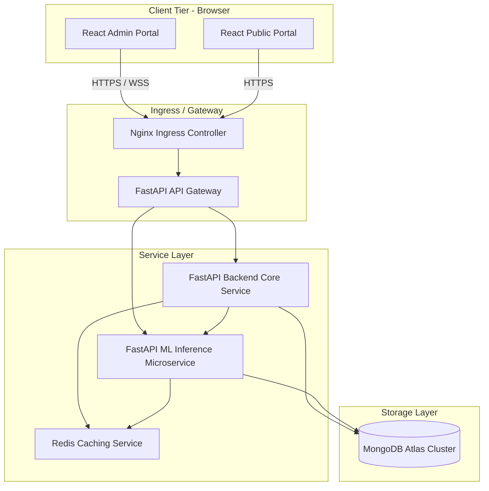
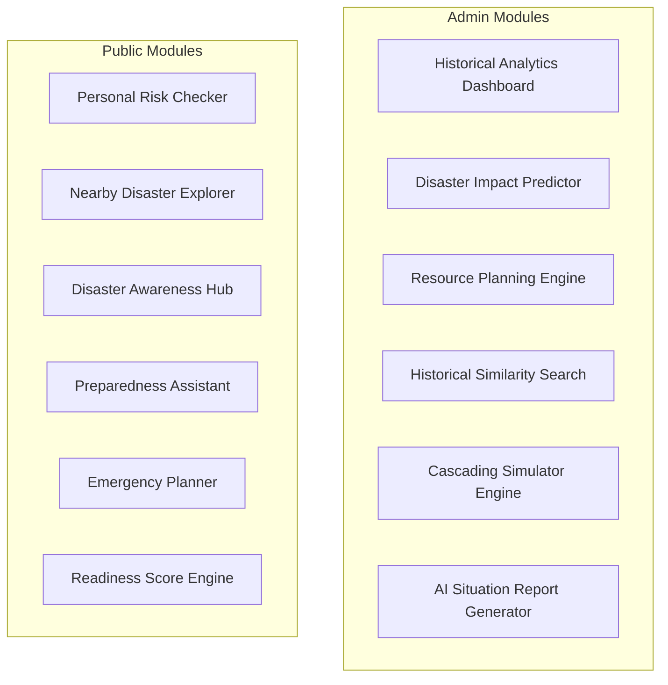
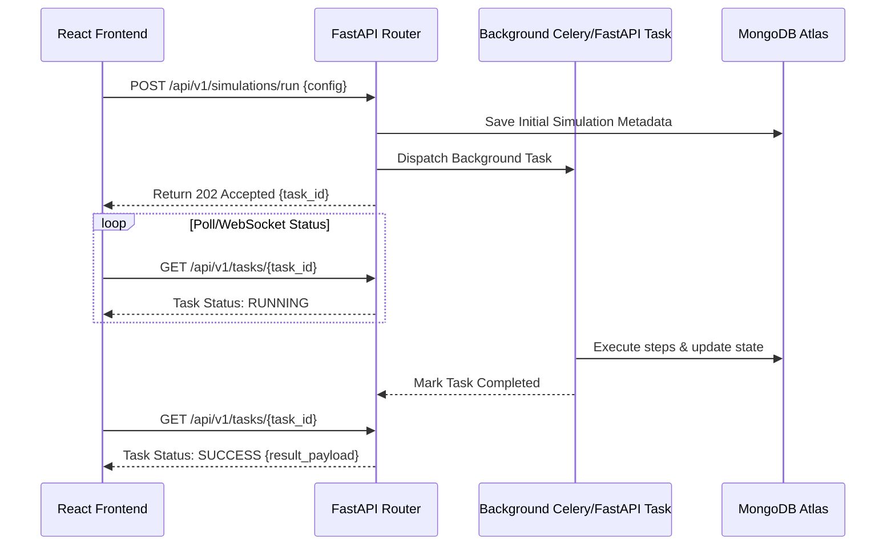
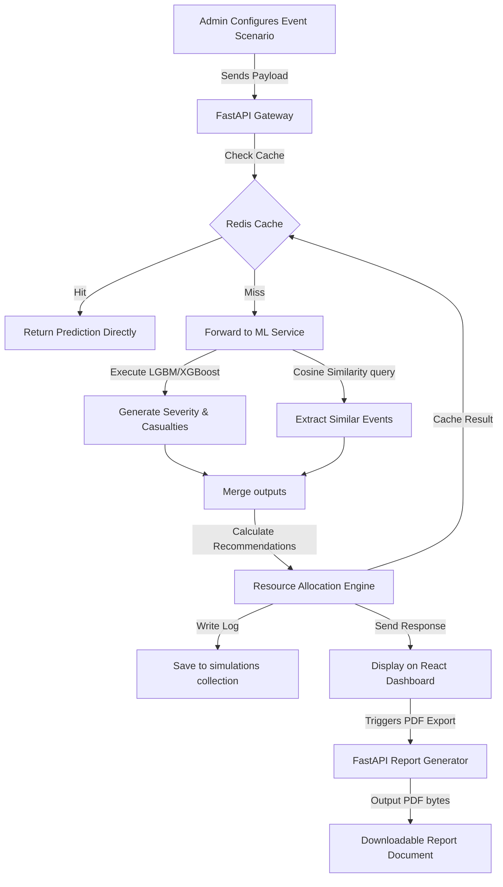
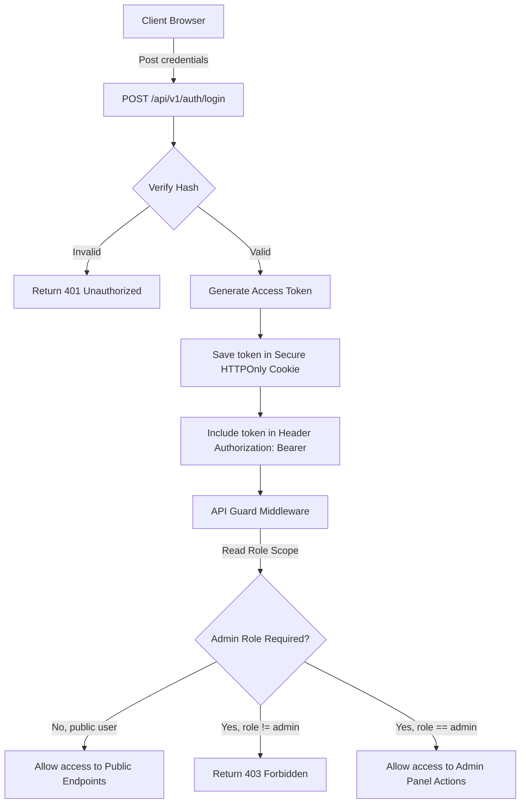
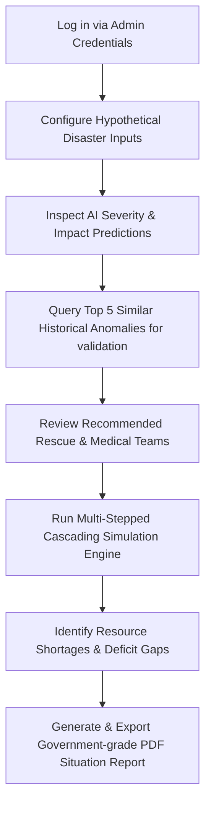
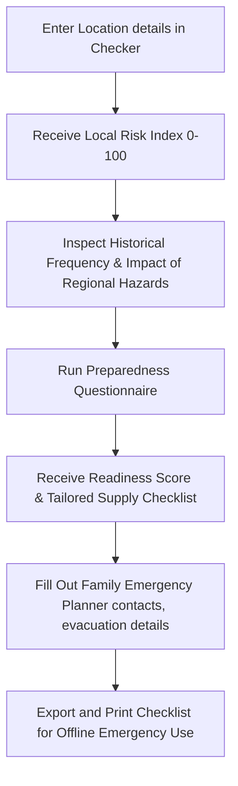
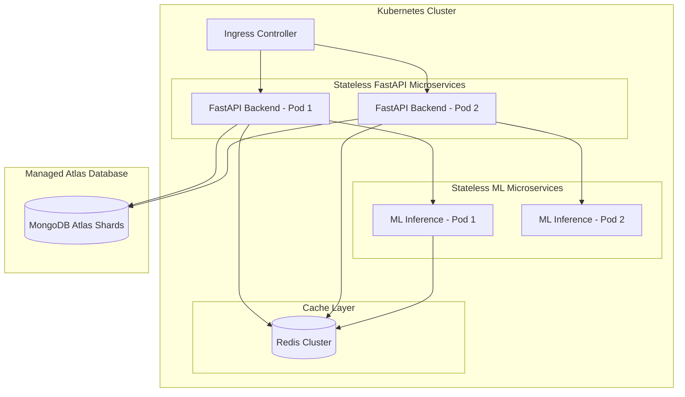

# System Architecture & Technical Design Document
## Project: AI Disaster Intelligence & Decision Support Platform

This document describes the software architecture, database design, service communications, and deployment models for the **AI Disaster Intelligence & Decision Support Platform**. Built using a React + FastAPI + MongoDB stack, this system provides disaster management authorities (Admins) and citizens (Public) with historical analytics, impact predictions, and resource coordination tools.

---

## 1. High-Level System Architecture

The system utilizes a decoupled, modern three-tier microservices-ready architecture:



### Components
1. **Client Tier**: Separate responsive Web Portals for Admins and Public Users, both built in React and Tailwind CSS.
2. **Proxy / Ingress Tier**: An Nginx load balancer handles SSL termination and forwards traffic to the FastAPI routing gateway.
3. **Application Tier**: 
   * **Core Service**: Processes data, simulates scenarios, generates reports, and acts as the orchestrator.
   * **ML Inference Service**: Dedicated microservice serving predictions (Severity, Impacts) and executing similarity searches.
   * **Redis Cache**: Memory-layer cache for fast lookups of simulation inputs, predictions, and session states.
4. **Data Tier**: **MongoDB Atlas** database cluster housing historical records, simulation logs, audit files, and readiness data.

---

## 2. Module Breakdown

The platform is divided into sub-modules mapped directly to user features:



### Admin Portal Modules
1. **Historical Analytics**: Translates raw EMDAT data into interactive timelines, category counts, and geographic distributions.
2. **Disaster Impact Predictor**: Accepts disaster type, subtype, location, and magnitude to return severity classes and casualties.
3. **Resource Planning Engine**: Recommends equipment, ambulances, and food rations while analyzing resource deficits.
4. **Similarity Search**: Queries similar past disasters to justify ML-driven impact estimates.
5. **Scenario Analysis & Simulator**: Compares multiple scenarios side-by-side and steps through sequential cascading impacts.
6. **AI Situation Report Generator**: Compiles metrics into markdown/PDF decision briefs.

### Public Portal Modules
1. **Personal Risk Checker**: Ingests country/state fields and outputs risk cards.
2. **Preparedness Assistant**: Generates customized emergency lists matching regional hazards.
3. **Emergency Planner**: Collects household data (size, elderly members, vehicles) to output survival protocols.
4. **Readiness Score**: Formulates a checklist score (0-100) indicating family preparedness.

---

## 3. Service Architecture

We structure services to run asynchronously, ensuring that blocking operations (like PDF generation or heavy database parsing) do not degrade API responsiveness:



### Async Architecture Specs
* **API Framework**: FastAPI running on `uvicorn` web workers, leveraging async/await pathways for database operations via the Motor driver.
* **Task Queues**: Standard Python `background_tasks` for short actions (e.g. log audits), with a standalone task queue (Celery or Redis Queue) for long simulations.
* **WebSockets**: Integrated within FastAPI to push real-time simulation step updates (e.g., Hour 0 -> Hour 6 cascading progress) straight to the Admin panel.

---

## 4. Frontend Architecture

The frontend is a React application built with TypeScript, structured for reuse:

```
src/
├── assets/             # Static SVGs, images
├── components/         # Reusable UI Components
│   ├── ui/             # Button, Input, Modal, Dropdown (Tailwind primitives)
│   ├── charts/         # Recharts wrappers for trends and risks
│   └── maps/           # Mapbox/Leaflet GIS view wrappers
├── contexts/           # Authentication state context
├── hooks/              # Custom query hooks (useAuth, usePredict, useSimulate)
├── layouts/            # DashboardLayout, PublicLayout, AuthLayout
├── pages/              # Admin pages, Public pages, Auth pages
├── services/           # Axios API client handlers
└── utils/              # Calculation helpers and converters
```

### Frontend Specifications
* **State Management**: Zustand for lightweight, boilerplate-free state.
* **Styling**: Tailwind CSS utilizing global theme tokens (vibrant hues, HSL dark mode, clear margins):
  * **Primary Colors**: Deep Navy/Indigo (`#1E293B` / `#4F46E5`) for government-grade authority.
  * **Status Colors**: Emerald for Low Risk, Amber for Medium, Orange for High, Rose/Crimson for Extreme.
* **Routing**: `react-router-dom` with guards enforcing authentication rules (`RequireAuth`, `RequireAdmin`).
* **Visualizations**: `recharts` for interactive dashboards.

---

## 5. Backend Architecture

The FastAPI backend is modularized with clear domain segregation:

```
app/
├── api/
│   ├── v1/
│   │   ├── endpoints/
│   │   │   ├── auth.py          # Signup, Login, Password Reset
│   │   │   ├── analytics.py     # EM-DAT aggregation lookups
│   │   │   ├── predict.py       # Severity and casualty inference
│   │   │   ├── simulations.py   # Simulation lifecycle and websocket channels
│   │   │   └── resources.py     # Calculations for emergency aid allocations
│   │   └── api.py               # Combined API routers
├── core/
│   ├── config.py                # Environment configurations (Pydantic Settings)
│   ├── database.py              # MongoDB async driver initialization (Motor)
│   └── security.py              # Password hashing and token generation
├── models/
│   ├── schemas/                 # Pydantic schemas (Request/Response validators)
│   └── domains/                 # Domain objects and ODM document entities
├── services/
│   ├── report_generator.py      # Markdown/PDF compilation tools
│   └── simulation_engine.py     # Timestep execution engine
└── main.py                      # FastAPI App definition
```

---

## 6. ML Service Architecture

The Machine Learning inference service runs on a dedicated instance to keep resource consumption isolated from core HTTP endpoints:

```
ml_service/
├── api/
│   └── endpoints/
│       ├── predict.py           # Returns Severity (LGBM) & Casualties (XGBoost)
│       └── similarity.py        # Returns Top 5 Nearest Neighbors (KNN)
├── models/
│   ├── registry/                # Saved binary models (.joblib / .bin)
│   │   ├── lgbm_severity.joblib
│   │   ├── xgboost_impact.joblib
│   │   └── knn_similarity.joblib
│   └── preprocessing/           # Pretrained encoders (RobustScaler, TargetEncoder)
├── services/
│   └── feature_pipeline.py      # Computes cyclic month sine/cosine & target encodes
└── main.py                      # FastAPI app entry point
```

### Runtime Details
* **Caching Layer**: Before querying tree models, the input configuration is hashed (SHA-256) and checked against **Redis**.
* **Model Pipeline Execution**: Implemented using pure `scikit-learn`, `xgboost`, and `lightgbm` pipelines wrapped in joblib files.

---

## 7. MongoDB Architecture

MongoDB Atlas is the single source of truth. The document-based schema handles rich categorical dimensions, location objects, and simulation logs cleanly.

### Collections and Schemas

#### 1. `disaster_records` (Stores historical EM-DAT events)
```json
{
  "_id": "ObjectId",
  "disNo": "string",
  "disasterGroup": "string",
  "disasterSubgroup": "string",
  "disasterType": "string",
  "disasterSubtype": "string",
  "country": "string",
  "iso": "string",
  "region": "string",
  "subregion": "string",
  "location": "string",
  "magnitude": 6.3,
  "magnitudeScale": "string",
  "geoJSON": {
    "type": "Point",
    "coordinates": [103.851959, 1.290270] 
  },
  "startDate": "ISODate",
  "endDate": "ISODate",
  "impact": {
    "deaths": 59,
    "injured": 27,
    "affected": 13000,
    "homeless": 200,
    "totalAffected": 13227,
    "economicDamageUSD": 1800000
  }
}
```

#### 2. `simulations` (Tracks scenario progression histories)
```json
{
  "_id": "ObjectId",
  "scenarioName": "string",
  "createdBy": "ObjectId",
  "disasterType": "string",
  "magnitude": 8.1,
  "country": "string",
  "status": "string",
  "createdAt": "ISODate",
  "timesteps": [
    {
      "hour": 0,
      "state": "landfall",
      "effects": ["structural damage", "power grids compromised"],
      "severity": "Extreme",
      "resourceDemand": { "ambulances": 20, "reliefCamps": 5 }
    },
    {
      "hour": 12,
      "state": "cascading",
      "effects": ["flooding triggers road failures", "hospital access cut off"],
      "severity": "Extreme",
      "resourceDemand": { "ambulances": 40, "reliefCamps": 12 }
    }
  ]
}
```

#### 3. `readiness_profiles` (Stores public preparedness data)
```json
{
  "_id": "ObjectId",
  "userId": "ObjectId",
  "familySize": 4,
  "hasElderly": true,
  "hasChildren": false,
  "vehiclesAvailable": 1,
  "readinessScore": 85,
  "checklistCompleted": [
    "water_storage",
    "emergency_kit",
    "evacuation_plan"
  ],
  "updatedAt": "ISODate"
}
```

### Database Indexing Strategy
To ensure sub-millisecond query performance on geographical dashboards and filters:
* **Geo Index**: `db.disaster_records.createIndex({ "geoJSON": "2dsphere" })` allows querying events inside radius ranges.
* **Compound Index**: `db.disaster_records.createIndex({ "country": 1, "disasterType": 1, "startDate": -1 })` accelerates region-specific analytics.
* **Search Index**: Text index on `"location"` and `"country"` fields for full-text lookup filters.

---

## 8. Data Flow Diagrams

### Prediction and Report Ingestion Data Flow



---

## 9. Authentication Architecture

We enforce **Role-Based Access Control (RBAC)** using JSON Web Tokens (JWT) secured with RS256 signing (or HS256 for rapid local setup).



### Key Elements:
* **Token Expiry**: Short-lived Access Token (15 minutes) + Long-lived Refresh Token (7 days) stored securely in `HTTPOnly` and `SameSite=Strict` cookies to mitigate Cross-Site Scripting (XSS).
* **Roles**:
  * `public_user`: Read-only historical data, edit family readiness checklist.
  * `admin`: Manage scenario sims, trigger AI reports, execute impact predictions.

---

## 10. Admin Workflow

A step-by-step operational pathway for Emergency Management Authorities using the platform:



---

## 11. Public Workflow

An operational sequence for public users preparing for environmental risks:



---

## 12. Simulation Workflow

The Simulator uses an event loop progressing in temporal increments (steps) to forecast secondary damage chains:

```
        +-------------------------------------------------------+
        |                  Initialize Simulator                 |
        |              (Input Category & Magnitude)             |
        +---------------------------+---------------------------+
                                    |
                                    v
        +---------------------------v---------------------------+
        |                 Retrieve Step 0 Impact                |
        |               (Baseline casualty & damage)            |
        +---------------------------+---------------------------+
                                    |
                                    v
        +---------------------------v---------------------------+
        |                  Step 1 (Hour 0 - Hour 6)             |
        |         - Trigger Primary infrastructural failures.    |
        |         - Calc multiplier (e.g. 1.2x damage if Rain).  |
        +---------------------------+---------------------------+
                                    |
                                    v
        +---------------------------v---------------------------+
        |                 Step 2 (Hour 6 - Hour 24)             |
        |         - Trigger Secondary cascading dependencies.    |
        |         - Road blockages -> Medical delays (+10% casualty)|
        +---------------------------+---------------------------+
                                    |
                                    v
        +---------------------------v---------------------------+
        |                Step 3 (Hour 24 - Hour 48)             |
        |         - Compute resource depletion ratios.           |
        |         - Deficits mapped to secondary vulnerability risks.|
        +---------------------------+---------------------------+
                                    |
                                    v
        +---------------------------v---------------------------+
        |                     Final Evaluation                  |
        |            (Generate Timeline Report Summary)         |
        +-------------------------------------------------------+
```

---

## 13. Scalability Considerations

1. **Database Sharding**: The MongoDB cluster is sharded by country/ISO keys. Queries are routing-optimized to ensure queries execute against local partition nodes.
2. **Query Caching**: Heavy mathematical aggregations on the EM-DAT database are pre-calculated every 24 hours. The resulting counts are stored in a key-value structure inside Redis to prevent high database workloads during dashboard usage.
3. **ML Microservice Autoscaling**: The ML service runs independently inside a stateless container. We configure **Horizontal Pod Autoscaling (HPA)** based on CPU/GPU usage to spin up additional workers during disaster simulations.

---

## 14. Deployment Architecture

Containerized cloud deployment optimized for high availability:



* **Orchestration**: Kubernetes managing stateless application pods.
* **Network Security Policies**: Strict ingress/egress rules allowing database communication only from verified application pod subnets.
* **Persistence Layer**: Managed MongoDB Atlas configured with multi-region replication and continuous automated backups.

---

## 15. Future Extensibility

1. **GIS Spatial Layers Integration**: Enable standard GeoJSON overlays (Leaflet/Mapbox) to visually project disaster boundaries over administrative boundaries.
2. **Real-time API Ingestion Integration**: Integrate Webhook pathways linking to USGS (Earthquakes) and WMO (Weather Warnings) to automatically initiate alerts.
3. **Civilian Community Crowdsourcing**: Future public app endpoints to report local situations during active disasters, generating telemetry maps for emergency response admins.
