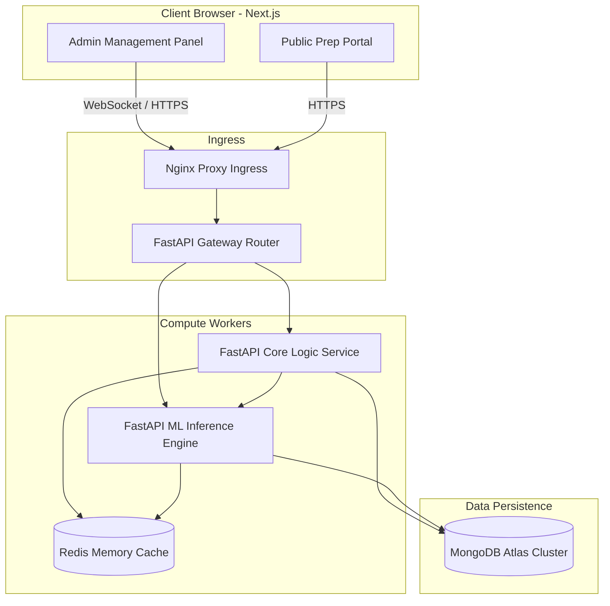

# AI Disaster Intelligence & Decision Support Platform
### A Data-Driven Crisis Mitigation & Preparedness Solution

[](https://www.python.org/)
[](https://fastapi.tiangolo.com/)
[](https://react.dev/)
[](https://tailwindcss.com/)
[](https://www.mongodb.com/atlas)
[](https://xgboost.readthedocs.io/)

---

## 📖 Executive Summary

The **AI Disaster Intelligence & Decision Support Platform** is an enterprise-grade web application designed to help **Disaster Management Authorities (Admins)** make operational allocation decisions and **Citizens (Public)** understand localized hazards using historical disaster records.

The platform is backed by the global **EM-DAT database (2000-2026)**, containing over **16,800 validated disaster records** spanning natural (geophysical, hydrological, meteorological, climatological, biological) and technological crisis events. It applies tree-based machine learning models (LightGBM, XGBoost) and clustering models to provide predictive hazard severity indices, expected casualty counts, resource deficit calculations, and time-stepped cascading simulations.

---

## 🛠️ Technology Stack & Core Concepts

* **Frontend**: React (TypeScript) + Next.js (Router & Server-side rendering primitives) + Tailwind CSS (HSL colors, glassmorphism theme tokens).
* **Backend**: FastAPI (Python) asynchronous endpoints + Uvicorn server processes.
* **Database**: MongoDB Atlas Cluster (sharded by country, 2dsphere indexes for coordinate lookups) + Redis Cache.
* **Machine Learning**: LightGBM (classification), XGBoost (multi-target regression), Scikit-Learn KNN (cosine nearest-neighbors similarity search), K-Means (vulnerability clustering), and SHAP (Shapley local feature explainability).
* **Async Ingestion & Task Queue**: Celery/Redis queue for execution workflows + WebSockets for real-time telemetry streams.

---

## 📐 Platform Core Architecture

The platform operates as a decoupled, multi-tier service layout:



---

## 🗂️ Module Architecture Overview

The platform splits operations between two discrete portals:

### 1. Admin Portal (Crisis Decision Support)
* **Disaster Statistics Dashboard**: Visualizes multi-decadal trends, event frequency filters, and historical casualty ranges.
* **Impact & Severity Predictor**: Returns forecasted casualty vectors (deaths, total affected) and severity indices (Low, Medium, High, Extreme) for custom hazard inputs.
* **Historical Similarity Finder**: Extracts the top 5 nearest matching past disasters to justify predictions.
* **Cascading Simulation Engine**: Runs time-stepped event loops forecasting secondary logistical failures (e.g. road blocks -> ambulance delays).
* **Resource Planner & Deficit Analyzer**: Calculates ambulance, relief camp, and food ration requirements, identifying local stock shortages.
* **AI Situation Report Generator**: Compiles metrics into markdown tables and exports downloadable PDF briefs.

### 2. Public Portal (Citizen Preparedness)
* **Personal Risk Checker**: Generates localized hazard cards, hazard frequencies, and a 0-100 regional risk score.
* **Nearby Disaster Explorer**: Identifies recent historical anomalies occurring within a radius of the user's location.
* **Preparedness Assistant**: Generates survival packing lists customized by hazard types.
* **Family Emergency Planner**: Collects household data to produce evacuation plans.
* **Readiness Score Engine**: Computes family preparedness ratings (0-100) using diagnostic questionnaires.

---

## 📂 Repository Navigation Map

Detailed design specifications are located in the [docs/](file:///d:/Projects/Personal/AI-Disaster-Orchastrator/docs/) folder and root directory:

```
├── ARCHITECTURE.md          # Global System Topology, workflows, and deployment specifications
├── ROADMAP.md               # 9-Phase technical project implementation roadmap
└── docs/
    ├── ADMIN_FEATURES.md    # Product specifications for admin portal modules
    ├── PUBLIC_FEATURES.md   # Product specifications for citizen preparedness modules
    ├── ML_DESIGN.md         # Algorithms, feature engineering, mathematical formulations, & metrics
    ├── DATABASE_DESIGN.md   # MongoDB Atlas collection schemas, validations, and indexes
    └── API_SPEC.md          # FastAPI endpoint layouts, payloads, and WebSocket routes
```

### Direct Specification Links:
* **System Architecture Blueprint**: [ARCHITECTURE.md](file:///d:/Projects/Personal/AI-Disaster-Orchastrator/ARCHITECTURE.md)
* **ML Design Specifications**: [docs/ML_DESIGN.md](file:///d:/Projects/Personal/AI-Disaster-Orchastrator/docs/ML_DESIGN.md)
* **MongoDB Schemas & Index Setup**: [docs/DATABASE_DESIGN.md](file:///d:/Projects/Personal/AI-Disaster-Orchastrator/docs/DATABASE_DESIGN.md)
* **FastAPI Endpoint Schemas**: [docs/API_SPEC.md](file:///d:/Projects/Personal/AI-Disaster-Orchastrator/docs/API_SPEC.md)
* **Engineering Implementation Roadmap**: [ROADMAP.md](file:///d:/Projects/Personal/AI-Disaster-Orchastrator/ROADMAP.md)

---

## 📈 Engineering Implementation Progress

We follow a progressive roadmap containing clear exit milestones:

* [x] **Phase 0: Research & Data Understanding** (EM-DAT distribution analysis, severity definitions)
* [x] **Phase 1: Ingestion & Data Pipeline** (MongoDB bulk writes, cleaning coordinates, validation filters)
* [x] **Phase 2: Machine Learning Foundation** (LightGBM severity, XGBoost regression, Cosine similarity, K-Means clustering)
* [x] **Phase 3: Core API & Admin Portal Basics** (FastAPI setup, Next.js routing layouts, basic dashboard tables)
* [ ] **Phase 4: Public Portal & Readiness Checker** (Questionnaires, risk checking components)
* [ ] **Phase 5: Scenario Template Engine** (Comparing saved simulations side-by-side)
* [ ] **Phase 6: Asynchronous Simulation Engine** (Cascading step event loop, WebSocket streams)
* [ ] **Phase 7: AI Situation Report & Exports** (Markdown compilers, PDF rendering streams)
* [ ] **Phase 8: Deployment & Optimization** (Docker Compose cluster, Redis cache checks)

---

## 🚀 Local Development Setup Quickstart

Follow these steps to configure and run the application services locally on your machine.

### 📋 Prerequisites
* **Python 3.10+** (For core backend and machine learning services)
* **Node.js 18+** & **npm** (For the React/Next.js frontend portal)
* **MongoDB Atlas Cluster** (or a local MongoDB database instance)
* **Docker & Docker Compose** (*Optional; containerization scripts are structured for production deployment and will be fully wired in the future under Phase 8*)

---

### 🛠️ Step-by-Step Installation

#### 1. Fork and Clone the Repository
Fork the repository on GitHub, then clone your fork locally:
```bash
git clone https://github.com/ahana4banerjee/AI-Disaster-Orchastrator.git
cd AI-Disaster-Orchastrator
```

#### 2. Configure Environment Variables
Copy the template configuration file in the project root directory to create your `.env` file:
```bash
cp .env.example .env
```
Open the `.env` file and configure your own keys:
* Set `MONGO_URI` to your MongoDB Atlas connection string.
* Set `SECRET_KEY` to a secure, random string (used for JWT encryption).

#### 3. Run the Database Initialization & Seeding Pipeline
Create your Python virtual environment, install backend dependencies, initialize MongoDB indexes/collections, and ingest the EM-DAT disaster dataset:
```bash
# Create Python virtual environment
python -m venv .venv

# Activate the virtual environment
# On Windows:
.venv\Scripts\activate
# On macOS/Linux:
source .venv/bin/activate

# Install backend dependencies
cd backend/
pip install -r requirements.txt
cd ..

# Initialize MongoDB collections and indexes
python scripts/db_init.py

# Ingest the historical EM-DAT dataset
python scripts/ingest_data.py --csv data/raw/public_emdat_custom_request_2026-06-16_b4cec7bb-ec36-4c87-9762-f7cc13e97076.csv
```

#### 4. Run the Python Backend Services
Start the Core API Backend and the Machine Learning Inference Service in separate terminal windows (make sure your virtual environment is active in both):

* **FastAPI Core Gateway API (Port 8000)**:
  ```bash
  cd backend/
  python -m uvicorn app.main:app --reload --host 127.0.0.1 --port 8000
  ```
* **ML Inference Microservice (Port 8001)**:
  ```bash
  cd ml_service/
  python -m uvicorn main:app --reload --host 127.0.0.1 --port 8001
  ```

#### 5. Run the Frontend Development Server
Open a new terminal window, navigate to the `frontend/` folder, install npm dependencies, and start the Next.js development server:
```bash
cd frontend/
npm install
npm run dev
```

---

### 🔗 Project Port References & API Docs
* **Next.js Client Dashboard**: [http://localhost:3000](http://localhost:3000) (Default test credentials: `admin_test@earth.org` / `SecurePassword123!`)
* **FastAPI Gateway Documentation**: [http://localhost:8000/docs](http://localhost:8000/docs)
* **FastAPI ML Service Documentation**: [http://localhost:8001/docs](http://localhost:8001/docs)

---

### 🐳 Containerized Production Deployments (Future Phase)
Docker containerization and production scaling workflows using `docker-compose` will be finalized in **Phase 8 (Deployment & Optimization)**. The current `docker-compose.yml` config serves as a scaffolding representation and is not required for local development runs.
