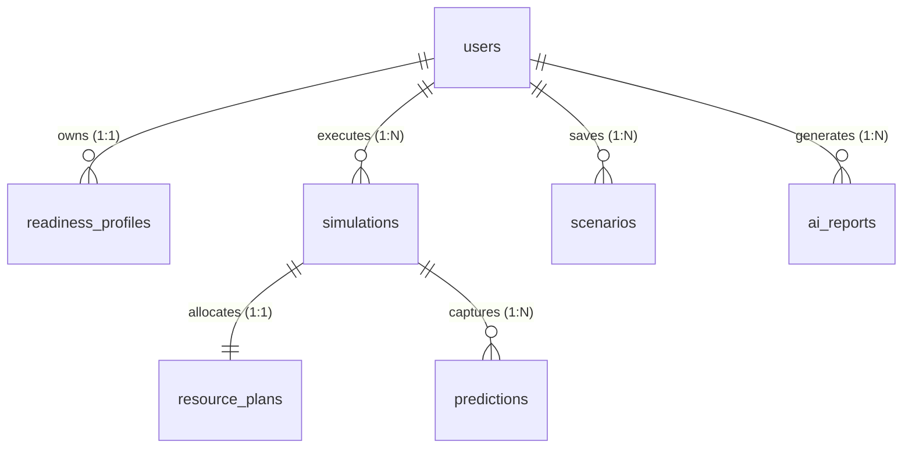

# MongoDB Database Architecture Design Document
## Project: AI Disaster Intelligence & Decision Support Platform

This document describes the database design, document structures, index configurations, schema validation rules, and aggregation logic for the MongoDB Atlas database.

---

## 1. Collection Design

The platform uses a document-based data model optimized for clean decoupling, geographic querying, and rapid statistical lookup.

```
+--------------------------------------------------------------+
|                    MongoDB Atlas Database                    |
+--------------------------------------------------------------+
       |
       +---> [disaster_records]  (EM-DAT historical events)
       +---> [users]             (Auth credentials, settings, roles)
       +---> [readiness_profiles](Public preparedness scores, checklists)
       +---> [predictions]       (Audit logs of ML inference inputs/outputs)
       +---> [scenarios]         (Saved hypothetical configurations)
       +---> [simulations]       (Time-step cascading simulation states)
       +---> [resource_plans]    (Estimates, available reserves, deficits)
       +---> [ai_reports]        (Situation summaries, metadata, PDF links)
       +---> [analytics_cache]   (Pre-aggregated stats for fast loading)
       +---> [regional_risk_clusters](Subregional K-Means risk profile assignments)
```

### Reference vs. Embedding Policy
* **Embed** when data is tightly bound, read together, and does not grow boundlessly (e.g., impact sub-objects within a disaster record, or checklist items inside a readiness profile).
* **Reference** when data is shared across multiple domains, has independent lifecycles, or is subject to boundless growth (e.g., references to a `userId` inside `simulations` or `readiness_profiles`).

---

## 2. Document Structures

All collections enforce standard BSON conventions:
* **`_id`**: Always a unique `ObjectID`.
* **Timestamps**: All documents maintain `createdAt` and `updatedAt` field tags using `ISODate` representations.
* **Geospatial coordinates**: Coordinates conform strictly to the GeoJSON specification: `{ "type": "Point", "coordinates": [longitude, latitude] }`.

---

## 3. Index Strategy

Indexes are optimized to minimize memory usage on MongoDB Atlas and keep query latencies under 10ms.

| Collection | Index Fields | Type | Purpose |
| :--- | :--- | :--- | :--- |
| **`disaster_records`** | `{ "geoJSON": "2dsphere" }` | Geospatial | Accelerates geographical radius queries |
| | `{ "country": 1, "disasterType": 1, "startDate": -1 }` | Compound | Speeds up analytics dashboard filters |
| **`users`** | `{ "email": 1 }` | Unique Single | Fast authentication lookup |
| **`predictions`** | `{ "createdAt": 1 }` | Single | Sorting audit histories |
| | `{ "inputHash": 1 }` | Single | Query caching checks |
| **`simulations`** | `{ "createdBy": 1, "createdAt": -1 }` | Compound | Lists user simulations |
| **`analytics_cache`** | `{ "cacheKey": 1 }` | Single | Fast retrieval of dashboard stats |
| | `{ "expiresAt": 1 }` | TTL | Automatically purges expired cache (expireAfterSeconds: 0) |
| **`regional_risk_clusters`** | `{ "subregion": 1 }` | Unique Single | Fast lookup of subregional risk profile |

---

## 4. Relationships Between Collections

We maintain a normalized reference mapping using `ObjectID` fields to prevent document size exhaustion:



* **`users` -> `readiness_profiles`**: Linked via `userId` reference inside the profile document.
* **`simulations` -> `resource_plans`**: Linked via `simulationId` reference inside the resource plan.
* **`simulations` -> `predictions`**: Raw ML inputs and output parameters are embedded within step arrays, but references map back to specific audited executions.

---

## 5. Historical Disaster Storage (`disaster_records`)

### Purpose
Contains the core EM-DAT dataset (2000-2026), capturing location parameters, magnitudes, and casualty metrics.

### Validation Schema
```json
{
  "$jsonSchema": {
    "bsonType": "object",
    "required": ["disNo", "disasterGroup", "disasterType", "country", "geoJSON", "startDate", "impact"],
    "properties": {
      "disNo": { "bsonType": "string" },
      "disasterGroup": { "bsonType": "string" },
      "disasterSubgroup": { "bsonType": "string" },
      "disasterType": { "bsonType": "string" },
      "disasterSubtype": { "bsonType": "string" },
      "country": { "bsonType": "string" },
      "iso": { "bsonType": "string", "pattern": "^[A-Z]{3}$" },
      "region": { "bsonType": "string" },
      "subregion": { "bsonType": "string" },
      "location": { "bsonType": "string" },
      "magnitude": { "bsonType": ["double", "int", "null"] },
      "magnitudeScale": { "bsonType": "string" },
      "geoJSON": {
        "bsonType": "object",
        "required": ["type", "coordinates"],
        "properties": {
          "type": { "enum": ["Point"] },
          "coordinates": {
            "bsonType": "array",
            "minItems": 2,
            "maxItems": 2,
            "items": { "bsonType": "double" }
          }
        }
      },
      "startDate": { "bsonType": "date" },
      "endDate": { "bsonType": "date" },
      "impact": {
        "bsonType": "object",
        "required": ["deaths", "injured", "totalAffected"],
        "properties": {
          "deaths": { "bsonType": "int" },
          "injured": { "bsonType": ["int", "null"] },
          "affected": { "bsonType": ["int", "null"] },
          "homeless": { "bsonType": ["int", "null"] },
          "totalAffected": { "bsonType": "int" },
          "economicDamageUSD": { "bsonType": ["int", "double", "null"] }
        }
      }
    }
  }
}
```

### Example Document
```json
{
  "_id": { "$oid": "60a4f5f5f5f5f5f5f5f5f501" },
  "disNo": "2026-0153-KEN",
  "disasterGroup": "Natural",
  "disasterSubgroup": "Hydrological",
  "disasterType": "Flood",
  "disasterSubtype": "Flood (General)",
  "country": "Kenya",
  "iso": "KEN",
  "region": "Africa",
  "subregion": "Sub-Saharan Africa",
  "location": "Mombasa, Kwale, Kilifi, Tana River",
  "magnitude": 25000.0,
  "magnitudeScale": "Km2",
  "geoJSON": {
    "type": "Point",
    "coordinates": [39.6682, -4.0435]
  },
  "startDate": { "$date": "2026-03-06T00:00:00Z" },
  "endDate": { "$date": "2026-03-31T00:00:00Z" },
  "impact": {
    "deaths": 59,
    "injured": 27,
    "affected": 13000,
    "homeless": 200,
    "totalAffected": 13227,
    "economicDamageUSD": 450000
  }
}
```

---

## 6. Prediction Storage (`predictions`)

### Purpose
Logs ML model execution parameters, feature transforms, targets, and output scores for auditing and cache hits.

### Validation Schema
```json
{
  "$jsonSchema": {
    "bsonType": "object",
    "required": ["inputHash", "inputs", "predictions", "confidenceScore", "createdAt"],
    "properties": {
      "inputHash": { "bsonType": "string" },
      "inputs": {
        "bsonType": "object",
        "required": ["disasterType", "country", "magnitude"]
      },
      "predictions": {
        "bsonType": "object",
        "required": ["severityClass", "expectedDeaths", "expectedTotalAffected", "expectedDamageUSD"]
      },
      "confidenceScore": { "bsonType": "double" },
      "createdAt": { "bsonType": "date" }
    }
  }
}
```

### Example Document
```json
{
  "_id": { "$oid": "60a4f5f5f5f5f5f5f5f5f502" },
  "inputHash": "e3b0c44298fc1c149afbf4c8996fb92427ae41e4649b934ca495991b7852b855",
  "inputs": {
    "disasterType": "Storm",
    "disasterSubtype": "Tropical cyclone",
    "country": "India",
    "region": "Southern Asia",
    "magnitude": 215.0,
    "startMonth": 10
  },
  "predictions": {
    "severityClass": "High",
    "expectedDeaths": 84,
    "expectedTotalAffected": 540000,
    "expectedDamageUSD": 12500000.0
  },
  "confidenceScore": 0.89,
  "createdAt": { "$date": "2026-06-16T22:30:00Z" }
}
```

---

## 7. Scenario Storage (`scenarios`)

### Purpose
Allows Admin operators to save and template pre-configured disaster metrics for side-by-side comparison.

### Example Document
```json
{
  "_id": { "$oid": "60a4f5f5f5f5f5f5f5f5f503" },
  "name": "Cyclone Odisha Baseline (Category 4 Equivalent)",
  "description": "Base template to assess cyclone preparedness limits in coastal districts.",
  "createdBy": { "$oid": "60a4f5f5f5f5f5f5f5f5f500" },
  "disasterType": "Storm",
  "disasterSubtype": "Tropical cyclone",
  "country": "India",
  "region": "Odisha",
  "magnitude": 220.0,
  "magnitudeScale": "Kph",
  "createdAt": { "$date": "2026-06-16T18:00:00Z" }
}
```

---

## 8. Simulation Storage (`simulations`)

### Purpose
Stores timelines and step states generated by the progression engine to display incremental cascading failures.

### Example Document
```json
{
  "_id": { "$oid": "60a4f5f5f5f5f5f5f5f5f504" },
  "scenarioId": { "$oid": "60a4f5f5f5f5f5f5f5f5f503" },
  "name": "Simulation Run - Cyclone Odisha Cat 4",
  "createdBy": { "$oid": "60a4f5f5f5f5f5f5f5f5f500" },
  "status": "Completed",
  "createdAt": { "$date": "2026-06-16T22:31:00Z" },
  "timesteps": [
    {
      "step": 0,
      "timeLabel": "Hour 0: Landfall",
      "status": "Active",
      "narrative": "Cyclone makes landfall. Strong coastal winds and primary surge damage occur.",
      "metrics": {
        "activeCasualties": 5,
        "displacedPopulation": 12000,
        "structuralDamagePercentage": 15
      },
      "infrastructureStates": {
        "powerGrid": "Degraded",
        "transportationRoads": "Operational",
        "hospitals": "Operational"
      }
    },
    {
      "step": 1,
      "timeLabel": "Hour 12: Cascading Inundation",
      "status": "Active",
      "narrative": "Heavy rainfall causes river rise. Major roadway corridors blocked by flash flooding.",
      "metrics": {
        "activeCasualties": 22,
        "displacedPopulation": 45000,
        "structuralDamagePercentage": 40
      },
      "infrastructureStates": {
        "powerGrid": "Failed",
        "transportationRoads": "Blocked",
        "hospitals": "Critical Capacity"
      }
    }
  ]
}
```

---

## 9. Resource Planning Storage (`resource_plans`)

### Purpose
Logs estimated response resources, compares values to localized stock levels, and records deficits.

### Example Document
```json
{
  "_id": { "$oid": "60a4f5f5f5f5f5f5f5f5f505" },
  "simulationId": { "$oid": "60a4f5f5f5f5f5f5f5f5f504" },
  "assessmentDate": { "$date": "2026-06-16T22:31:05Z" },
  "resources": [
    {
      "type": "Ambulances",
      "required": 45,
      "available": 30,
      "deficit": 15,
      "status": "Deficit Critical"
    },
    {
      "type": "Relief Camps",
      "required": 12,
      "available": 15,
      "deficit": 0,
      "status": "Sufficient"
    },
    {
      "type": "Medical Teams",
      "required": 10,
      "available": 8,
      "deficit": 2,
      "status": "Deficit Low"
    }
  ],
  "deficitAnalysisSummary": "Critical transport constraints due to ambulance shortfalls. Road blockages from step logs intensify these delays."
}
```

---

## 10. User Storage (`users`)

### Purpose
Unified storage containing user profile credentials, roles, authorization permissions, and secure state metrics.

### Validation Schema
```json
{
  "$jsonSchema": {
    "bsonType": "object",
    "required": ["email", "passwordHash", "role", "isActive", "createdAt"],
    "properties": {
      "email": { "bsonType": "string", "pattern": "^[a-zA-Z0-9._%+-]+@[a-zA-Z0-9.-]+\\.[a-zA-Z]{2,}$" },
      "passwordHash": { "bsonType": "string" },
      "role": { "enum": ["admin", "public_user"] },
      "isActive": { "bsonType": "bool" },
      "createdAt": { "bsonType": "date" }
    }
  }
}
```

### Example Document
```json
{
  "_id": { "$oid": "60a4f5f5f5f5f5f5f5f5f506" },
  "email": "citizen.prepared@earth.org",
  "passwordHash": "$2b$12$K3d9A.U.R1c9U2H7P1L.7Oh2O8bH3N4D5J6e7P8o9i1a2s3d4f5g6",
  "role": "public_user",
  "isActive": true,
  "createdAt": { "$date": "2026-06-16T22:00:00Z" }
}
```

---

## 10a. Citizen Readiness Profiles (`readiness_profiles`)

### Purpose
Contains the citizen preparedness progress checklist items, overall safety score (0-100), and custom family emergency plans.

### Index Config
* Unique Compound Index: `{ "userId": 1 }` to prevent duplicate user profiles.

### Example Document
```json
{
  "_id": { "$oid": "60a4f5f5f5f5f5f5f5f5f50b" },
  "userId": "60a4f5f5f5f5f5f5f5f5f506",
  "checkedItems": [
    "water_3_days",
    "food_3_days",
    "first_aid_kit",
    "copies_documents",
    "cash_reserves"
  ],
  "score": 50,
  "familyPlan": {
    "memberCount": 4,
    "contacts": "[{\"name\":\"John\",\"relation\":\"Cousin\",\"phone\":\"555-0199\"}]",
    "evacuationRoute": "Designated EOC high-ground shelter 3",
    "medicalNeeds": "Insulin doses in fridge container",
    "petAssistance": "Cat carriers and dry food pack",
    "updatedAt": { "$date": "2026-07-01T02:00:00Z" }
  },
  "updatedAt": { "$date": "2026-07-01T02:00:00Z" }
}
```

---

## 11. Admin Storage (`admin_audit_logs`)

### Purpose
Strict logging collection tracking configuration modifications, simulations executed, and PDF export activities.

### Example Document
```json
{
  "_id": { "$oid": "60a4f5f5f5f5f5f5f5f5f507" },
  "adminUserId": { "$oid": "60a4f5f5f5f5f5f5f5f5f500" },
  "ipAddress": "192.168.10.150",
  "action": "EXECUTE_SIMULATION",
  "targetCollection": "simulations",
  "targetObjectId": { "$oid": "60a4f5f5f5f5f5f5f5f5f504" },
  "details": "Triggered temporal step simulation for Odisha cyclone Cat 4.",
  "timestamp": { "$date": "2026-06-16T22:31:00Z" }
}
```

---

## 12. AI Report Storage (`ai_reports`)

### Purpose
Logs decision summaries compiled for authorities, tracking markdown structure details and PDF storage URLs.

### Example Document
```json
{
  "_id": { "$oid": "60a4f5f5f5f5f5f5f5f5f508" },
  "simulationId": { "$oid": "60a4f5f5f5f5f5f5f5f5f504" },
  "compiledBy": { "$oid": "60a4f5f5f5f5f5f5f5f5f500" },
  "title": "SITREP - Cyclone Odisha Coastal Response Plan",
  "sections": {
    "situationSummary": "Tropical cyclone landfall verified. Primary impacts focused on power infrastructure failure.",
    "riskAssessment": "Extreme threat level on secondary road corridors due to flooding.",
    "suggestedActions": "Re-route ambulances from inland clusters to bridge operational deficits."
  },
  "pdfStorageUrl": "https://s3.amazonaws.com/ai-disaster-orch/sitreps/2026/odisha_sitrep_60a4f504.pdf",
  "createdAt": { "$date": "2026-06-16T22:32:00Z" }
}
```

---

## 13. Analytics Storage (`analytics_cache`)

### Purpose
A pre-calculated statistical caching collection serving aggregate charts to prevent heavy calculation loops during query load spikes.

### Example Document
```json
{
  "_id": { "$oid": "60a4f5f5f5f5f5f5f5f5f509" },
  "cacheKey": "stats_global_by_type_2000_2026",
  "data": [
    { "disasterType": "Flood", "count": 6840, "totalDeaths": 45120, "economicDamageMillions": 18500 },
    { "disasterType": "Earthquake", "count": 2130, "totalDeaths": 120500, "economicDamageMillions": 65000 },
    { "disasterType": "Storm", "count": 4120, "totalDeaths": 92300, "economicDamageMillions": 92000 }
  ],
  "expiresAt": { "$date": "2026-06-17T22:30:00Z" } 
}
```

---

## 13a. Regional Risk Clusters Storage (`regional_risk_clusters`)

### Purpose
Pre-calculated regional risk profiling data compiled using the K-Means clustering model. Serves lookups for local risk profiling.

### Example Document
```json
{
  "_id": { "$oid": "60a4f5f5f5f5f5f5f5f5f50a" },
  "subregion": "Southern Asia",
  "frequency": 3.42,
  "mortalityRate": 0.00045,
  "economicRisk": 0.0012,
  "maxMagnitude": 7.8,
  "clusterId": 3,
  "riskTier": "Extreme",
  "updatedAt": { "$date": "2026-06-19T23:39:58Z" }
}
```

---

## 14. Aggregation Strategies

To generate metrics without querying individual database rows on client requests, we use MongoDB aggregation pipelines:

### Pipeline 1: Historical Trend Analysis
Retrieves the total disaster events and average economic damages grouped by year and type:
```javascript
db.disaster_records.aggregate([
  {
    $match: {
      "startDate": {
        $gte: ISODate("2000-01-01T00:00:00Z"),
        $lte: ISODate("2026-12-31T23:59:59Z")
      }
    }
  },
  {
    $group: {
      "_id": {
        "year": { $year: "$startDate" },
        "disasterType": "$disasterType"
      },
      "eventCount": { $sum: 1 },
      "averageDamage": { $avg: "$impact.economicDamageUSD" }
    }
  },
  {
    $project: {
      "_id": 0,
      "year": "$_id.year",
      "disasterType": "$_id.disasterType",
      "eventCount": 1,
      "averageDamage": { $round: ["$averageDamage", 2] }
    }
  },
  { $sort: { "year": 1, "eventCount": -1 } }
]);
```

### Pipeline 2: Regional Risk Vector Analysis
Compiles total frequency, total deaths, and max magnitude per subregion to feed the clustering models:
```javascript
db.disaster_records.aggregate([
  {
    $group: {
      "_id": "$subregion",
      "totalEvents": { $sum: 1 },
      "accumulatedDeaths": { $sum: "$impact.deaths" },
      "maxMagnitude": { $max: "$magnitude" }
    }
  },
  {
    $project: {
      "subregion": "$_id",
      "totalEvents": 1,
      "accumulatedDeaths": 1,
      "maxMagnitude": 1
    }
  }
]);
```

---

## 15. Scalability Considerations

1. **Sharding Key Selection**:
   * For the core `disaster_records` collection, we choose a compound sharding key: `{ "country": 1, "disasterType": 1 }`.
   * **Why**: Most client analytical requests partition maps and metrics by Country boundaries. This sharding key keeps operations localized, minimizing cross-shard aggregation latency.
2. **TTL Indexing**:
   * We apply a Time-To-Live (TTL) index on the `analytics_cache` collection.
   * **Command**: `db.analytics_cache.createIndex({ "expiresAt": 1 }, { expireAfterSeconds: 0 })`.
   * This automatically keeps the memory consumption of cached dashboard snapshots optimized.
3. **Write Path Optimizations**:
   * For heavy ingestion runs (such as database sync additions of EM-DAT historical imports), the system uses MongoDB's bulk write operations (`bulkWrite()`) rather than isolated `insertOne()` calls. This optimizes network roundtrips and indexes updates.
