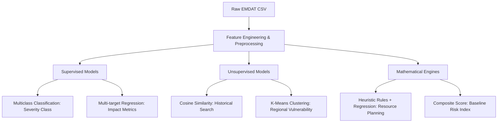
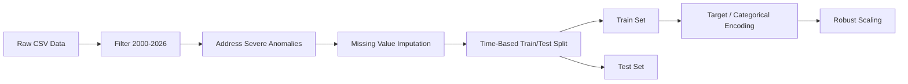
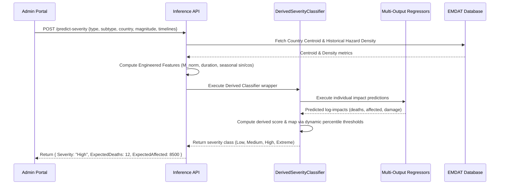
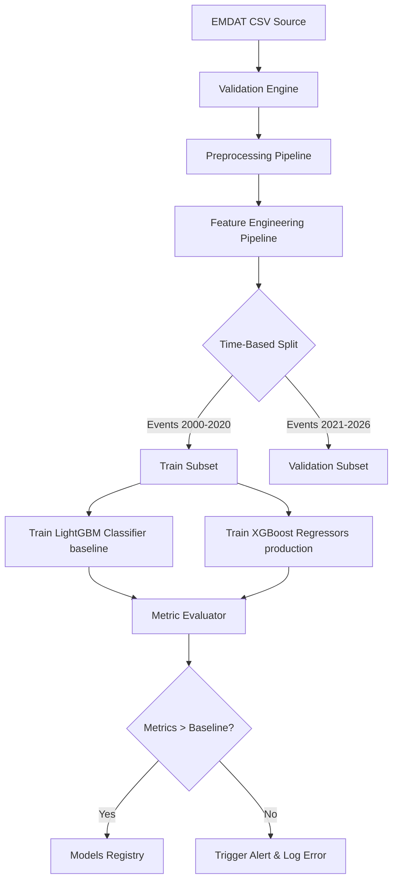

# Machine Learning Architecture Design Document
## AI Disaster Intelligence & Decision Support Platform

This document outlines the machine learning architecture, modeling methodologies, data pipelines, and deployment strategies for the **AI Disaster Intelligence & Decision Support Platform**. This platform leverages the EM-DAT (Emergency Events Database) historical record (2000–2026) to provide predictive analytics and decision support tools for Disaster Management Authorities (Admins) and Citizens (Public).

---

## 1. ML Philosophy
We approach this architecture with a focus on **explainability, robustness, data efficiency, and operational simplicity**. Disaster response decision-support systems require high trust; therefore, black-box deep learning is rejected in favor of transparent, explainable tabular models. 

### Core Principles
1. **Explainability Over Complexity**: Human operators must understand *why* a model predicts a specific severity level or impact figure. We prioritize tree-based ensemble models combined with SHAP (SHapley Additive exPlanations) and nearest-neighbor search.
2. **Tabular-First Architecture**: The EM-DAT dataset consists of highly structured, sparse tabular records (~16,800 events). Deep learning architectures (e.g., TabNet or deep MLPs) perform poorly on small, highly skewed tabular datasets compared to Gradient Boosted Decision Trees (GBDTs).
3. **No Weather/Prediction Models**: We explicitly do *not* build physical weather forecasting or earthquake prediction engines. Instead, we perform **conditioned conditional impact estimation**—i.e., *given* a disaster event of type $T$ and magnitude $M$ in region $R$, what is the predicted impact?
4. **Heuristics & ML Hybridization**: When training labels are missing or sparse, we fuse domain-specific emergency management heuristics with statistical modeling.

---

## 2. Problem Formulation
The platform's capabilities are formulated into four main mathematical and statistical problems:



### Formulations
1. **Disaster Severity Classification (Supervised)**:
   A multiclass classification problem where a vector of inputs $X_i$ is mapped to a discrete ordinal scale $Y_{sev} \in \{\text{Low}, \text{Medium}, \text{High}, \text{Extreme}\}$.
2. **Disaster Impact Prediction (Supervised)**:
   A multi-output regression problem where $X_i$ is mapped to a vector of continuous targets:
   $$\vec{Y}_{impact} = [y_{deaths}, y_{affected}, y_{damage}]^T$$
   where $y_{deaths} \ge 0$, $y_{affected} \ge 0$, and $y_{damage} \ge 0$ (economic loss in USD).
3. **Historical Similarity Search (Unsupervised)**:
   A nearest-neighbor search problem where a metric space $(\mathcal{X}, d)$ is defined, and for an input scenario $x^*$, we retrieve the top $k$ historical records $x_i$ minimizing $d(x^*, x_i)$.
4. **Regional Risk Clustering (Unsupervised)**:
   A clustering problem partitioning geographical regions $R$ into distinct vulnerability clusters $C_k$ based on aggregate frequency and historical severity.

---

## 3. Supervised Learning Tasks

### Task 3.1: Disaster Severity Classification
* **Objective**: Categorize incoming/hypothetical disaster scenarios into discrete emergency management response levels.
* **Input Features ($X$)**: Disaster Type, Subtype, Country, Region, Latitude, Longitude, Magnitude, Month of Year.
* **Target Variable ($Y$)**: Ordinal Class Label (0: Low, 1: Medium, 2: High, 3: Extreme). Derived via a custom severity index thresholding strategy (defined in Section 11).

### Task 3.2: Multi-Target Impact Regression
* **Objective**: Predict the physical and economic magnitude of a disaster's aftermath.
* **Input Features ($X$)**: Identical to Task 3.1.
* **Target Variables ($Y_{reg}$)**:
  * `Total Deaths` (integer count)
  * `Total Affected` (integer count representing injured, affected, and homeless)
  * `Total Damage, Adjusted ('000 US$)` (continuous economic damage adjusted for inflation)

---

## 4. Unsupervised Learning Tasks

### Task 4.1: Historical Similarity Search
* **Objective**: Search the 16,800 records database to extract the 5 most statistically similar past events to serve as analog cases for responders.
* **Input Vector ($x^*$)**: User-defined parameters (Disaster Type, Subregion, Magnitude, Lat/Long).
* **Output**: Top 5 records ranked by similarity score.

### Task 4.2: Regional Risk Profiling and Clustering
* **Objective**: Group global subregions into 4 risk tiers (Low, Medium, High, Extreme) based on multi-decadal vulnerability patterns.
* **Input Features**: Aggregated regional metrics (mean magnitude, frequency per decade, total deaths per capita, total damages/GDP ratio).
* **Output**: Persistent cluster assignments updated on database refreshes.

---

## 5. Recommended Models

We select a standard, high-performance stack of classical and tree-based machine learning algorithms:

| Algorithm / Model | Task | Target / Output Type | Library |
| :--- | :--- | :--- | :--- |
| **Derived Severity Classifier** (XGBoost Regressors + Dynamic Thresholds) | Severity Classification (Production) | Derived Ordinal Category | `xgboost` / custom |
| **LightGBM Classifier** (Baseline) | Severity Classification Benchmark | Multiclass Ordinal Category | `lightgbm` |
| **Multi-Output Regressors** (XGBoost) | Impact Prediction | Multi-target Continuous Values | `xgboost` |
| **K-Nearest Neighbors (KNN)** / Cosine Metric | Similarity Search | Index of top-k database rows | `scikit-learn` |
| **K-Means / DBSCAN** | Regional Risk Clustering | Categorical Cluster ID | `scikit-learn` |

---

## 6. Why Each Model is Chosen

### 1. Derived Severity Classifier (Production Model) & LightGBM (Baseline Model)
* **Derived Workflow**: Predicts the individual physical impact components (deaths, affected, damages) using XGBoost Regressors and computes the severity score deterministically, mapping it via dynamic percentile thresholds. This provides operators with explainable, granular forecasts rather than a black-box severity class.
* **Baseline Multiclass benchmark**: LightGBM is kept as a baseline classifier. It has fast leaf-wise growth but suffers from high false alarms (~16% Extreme class precision) when predicting highly skewed ordinal boundaries directly.
* **Leakage-Free Feature Engineering**: Category target encoding uses out-of-fold K-Fold target encoding to prevent leakage. It also uses disaster duration (`duration_days`) to bypass sparse magnitude values in recent periods.

### 3. K-Nearest Neighbors (Historical Similarity)
* **Exact Math**: No model training is strictly required for pure similarity search. Responders need absolute certainty that the returned events are mathematically closest in the feature space, which KNN provides directly.
* **Explainability by Design**: Returning actual historical events is the ultimate form of explainability (case-based reasoning).

### 4. K-Means with Silhouette Optimization (Clustering)
* **Global Interpretation**: Partitioning regional centroids allows emergency managers to group locations by overall risk. We use K-Means for structural simplicity and ease of mapping centroids back to specific vulnerability dimensions (e.g., "High Damage/Low Mortality" vs "Low Damage/High Mortality").

---

## 7. Target Variables

The targets are derived from EM-DAT columns:

1. **`Total Deaths`**: Continuous, integer value. Highly right-skewed.
2. **`Total Affected`**: Continuous, integer value. Combines `No. Injured`, `No. Affected`, and `No. Homeless` to represent the overall displaced/injured population.
3. **`Total Damage, Adjusted ('000 US$)`**: The inflation-adjusted cost of the disaster. Represented in thousands of US dollars.
4. **`Severity Class`**: Formulated ordinal target. Since the database lacks a severity column, we compute a compound index:
   $$S_i = w_1 \cdot \log_{10}(Deaths_i + 1) + w_2 \cdot \log_{10}(TotalAffected_i + 1) + w_3 \cdot \log_{10}(DamageAdjusted_i + 1)$$
   The raw score $S_i$ is mapped using percentiles ($P_{25}, P_{75}, P_{95}$) into:
   * **Low**: $S_i \le P_{25}$
   * **Medium**: $P_{25} < S_i \le P_{75}$
   * **High**: $P_{75} < S_i \le P_{95}$
   * **Extreme**: $S_i > P_{95}$

---

## 8. Feature Engineering Strategy

We apply specific feature engineering to transform sparse geographic and temporal columns into powerful predictive signals:

```
Raw CSV Columns           Engineered Features
----------------------------------------------------------------------
Latitude/Longitude  --->  Geohash, Distance to Coast, Country Centroid Delta
Start Year/Month    --->  Month Sin/Cos (Cyclic), Decade, Time Elapsed
Magnitude Scale     --->  Normalized Magnitude (scaled within Disaster Type)
Region/Subregion    --->  Target-Encoded Historical Frequency
Associated Types    --->  Secondary Cascading Indicator Flags (One-Hot)
```

### Detailed Transformations:
1. **Normalized Magnitude**: Magnitude scales vary (e.g., Richter scale for earthquakes vs Wind speed in Kph for storms). We construct `Normalized_Magnitude`:
   $$M_{norm} = \frac{M - \mu_{type}}{\sigma_{type}}$$
   where $\mu_{type}$ and $\sigma_{type}$ are computed specifically for each `Disaster Type`.
2. **Cyclic Temporal Features**: Start Month is transformed into cyclic coordinates to capture seasonal disaster cycles (e.g., hurricane seasons):
   $$\text{Month}_{sin} = \sin\left(\frac{2 \pi \cdot \text{Month}}{12}\right), \quad \text{Month}_{cos} = \cos\left(\frac{2 \pi \cdot \text{Month}}{12}\right)$$
3. **Historical Regional Density**: Calculate the baseline hazard frequency for each Subregion:
   $$\text{Hazard\_Density}_{type, region} = \frac{\text{Count}(Disasters_{type} \text{ in } Region)}{\text{Total Years}}$$
4. **Geographic Delta**: Distance of the event coordinates from the country centroid coordinates to capture interior vs border vulnerability.
5. **Cascading Indicators**: `Associated Types` (e.g., "Flood|Slide") is parsed. We create binary flags: `has_landslide`, `has_flood`, `has_avalanche` to represent multi-hazard chains.

---

## 9. Data Preprocessing Pipeline

To ensure model generalizability and avoid data leakage:



### Preprocessing Protocol
1. **Filtering**: Drop records prior to Year 2000 to maintain high data quality (historical reporting was inconsistent earlier).
2. **Target Transform**: Apply a logarithmic transform to regression targets to stabilize variance:
   $$y' = \log_e(y + 1)$$
3. **Categorical Encoding**:
   * Low cardinality columns (`Disaster Group`, `Disaster Subgroup`): One-Hot Encoding.
   * High cardinality columns (`Country`, `Subregion`, `Disaster Subtype`): Target Encoding (with smoothing parameter $\alpha=10$ to prevent leakage during cross-validation) or native LightGBM grouping.
4. **Numerical Scaling**: We use `RobustScaler` (based on percentiles: 25th to 75th range) for continuous variables like `Magnitude` and `CPI` to limit the influence of extreme disaster outliers.

---

## 10. Missing Value Strategy

EM-DAT data has substantial missingness, especially in historical economic damage and magnitudes. 

| Feature | Missingness | Strategy | Implementation Details |
| :--- | :--- | :--- | :--- |
| **`Magnitude`** | ~35% | Group-by Median Imputation | Impute missing magnitudes using the median magnitude for that specific `Disaster Type` + `Disaster Subtype` combination. If the subtype is also null, fall back to global disaster type median. |
| **`Total Deaths`** | ~15% | Zero Imputation + Flag | A null value in historical emergency data usually implies no registered deaths. Impute with `0` and create a binary indicator column `Deaths_IsMissing`. |
| **`Total Damage`** | ~50% | Predictive Imputation (Iterative) | For features where damage is missing, train a temporary Random Forest Regressor on features (`Magnitude`, `Country`, `Total Affected`) to predict and impute the damage. |
| **`Latitude / Longitude`** | ~30% | Country Centroid Fallback | If coordinates are missing, resolve the location details via the country centroid or region centroid. |

---

## 11. Severity Prediction Design

The Severity Class predictor categorizes the overall severity of a hypothetical or occurring disaster using a derived pipeline wrapper.



### Implementation Pipeline:
1. **Label Generation (Ground Truth)**:
   For every historical row, calculate $S_i$ (equation in Section 7). Divide data into 4 intervals using percentiles:
   $$\text{Label}_i = \begin{cases} 
   0 \text{ (Low)} & S_i \le P_{25} \\
   1 \text{ (Medium)} & P_{25} < S_i \le P_{75} \\
   2 \text{ (High)} & P_{75} < S_i \le P_{95} \\
   3 \text{ (Extreme)} & S_i > P_{95}
   \end{cases}$$
2. **Model Selection**: Production wraps three independent XGBoost Regressors (`DerivedSeverityClassifier`). The baseline multiclass benchmark uses a direct `LGBMClassifier` with balanced class weights.
3. **Dynamic Thresholds / Post-Processing**:
   Instead of static thresholds which suffer from regression-to-the-mean (causing Extreme recall to drop to ~4%), thresholds are computed dynamically as the percentiles ($P_{25}, P_{75}, P_{95}$) of the model's own train-set predictions.

---

## 12. Impact Prediction Design

Provides quantitative estimations of disaster outcomes and feeds directly into the severity wrapper.

```mermaid
graph LR
    Inputs[Input Scenario] --> Feat[Feature Pipeline]
    Feat --> ModelReg{Multi-Output Regressors}
    ModelReg --> LogD[Log-Deaths Prediction]
    ModelReg --> LogA[Log-Affected Prediction]
    ModelReg --> LogP[Log-Damage Prediction]
    
    LogD --> ExpD[10^x - 1] --> OutD[Expected Deaths]
    LogA --> ExpA[10^x - 1] --> OutA[Expected Affected]
    LogP --> ExpP[(10^x - 1)*1000] --> OutP[Economic Damage USD]
    
    OutD & OutA & OutP --> DerivedScore[Derived Severity Score Calculation]
    DerivedScore --> DynamicThresholds[Dynamic Percentile Thresholding]
    DynamicThresholds --> OutClass[Expected Severity Class]
```

### Mathematical Specifications
1. **Target Scaling**: To prevent gradient explosion during tree construction due to values ranging from 0 to millions, targets are transformed:
   $$z = \log_{10}(y + 1)$$
2. **Loss Function**: Mean Squared Error (MSE) on the log-transformed space. This is equivalent to optimizing the Root Mean Squared Logarithmic Error (RMSLE) in the original scale.
3. **Exponentiation**: Predictions are transformed back using:
   $$\hat{y} = \max(0, 10^z - 1)$$

---

## 13. Historical Similarity Search Design

Allows operators to pull matching historical events.

### Feature Space Definition
For similarity calculations, we construct a normalized feature space vector $\vec{v}$ for every disaster:
$$\vec{v} = [ \vec{v}_{geo}, \vec{v}_{temporal}, v_{magnitude} ]$$
* $\vec{v}_{geo}$: Target Encoded Subregion, Latitude, Longitude (normalized).
* $\vec{v}_{temporal}$: Cyclic Sin/Cos start month.
* $v_{magnitude}$: Type-normalized Magnitude value.

### Metric Formulation
We compute the Cosine distance to find similar events. Let $\vec{v}_{input}$ be the target scenario vector, and $\vec{v}_i$ be a candidate record in EMDAT:
$$D_{cos}(\vec{v}_{input}, \vec{v}_i) = 1 - \frac{\vec{v}_{input} \cdot \vec{v}_i}{\|\vec{v}_{input}\| \|\vec{v}_i\|}$$
We construct an offline index using `scikit-learn`'s `NearestNeighbors(metric='cosine', algorithm='brute')`. 
At query time, the system retrieves the top 5 records with the lowest $D_{cos}$.

---

## 14. Regional Risk Clustering Design

Groups regions into long-term risk profiles to assist government agencies and NGOs with vulnerability categorization.

### Clustering Protocol
1. **Aggregation**: Map the 16,800 events to their geographical regions. For each `Subregion` (or Admin level if coordinates are dense), calculate:
   * **Frequency**: Count of events per decade.
   * **Mortality Rate**: Average Deaths / Total Country Population.
   * **Economic Risk**: Average Damage / Country GDP.
   * **Max Magnitude**: Max recorded normalized magnitude.
2. **Clustering Engine**: Apply $K$-Means clustering with $K=4$ representing:
   * `Cluster 0`: Low Vulnerability / Low Frequency
   * `Cluster 1`: Low Vulnerability / High Frequency (high resilience)
   * `Cluster 2`: High Vulnerability / Low Frequency (unprepared zones)
   * `Cluster 3`: Extreme Vulnerability / High Frequency (critical intervention zones)
3. **Execution Schedule**: This model is trained offline and run monthly. The results are stored in a read-only table `regional_risk_clusters` to serve instant lookups.

---

## 15. Resource Recommendation Engine Design

Fuses machine learning outputs with standard emergency management checklists to provide recommended deployment counts.

```
       +-----------------------+      +---------------------------+
       |   Predicted Impact    |      |  Historical Aid Baseline  |
       |  (Deaths, Affected)   |      |  (Appeal, AID Contrib)    |
       +-----------+-----------+      +-------------+-------------+
                   |                                |
                   +---------------+----------------+
                                   |
                                   v
             +---------------------v---------------------+
             |  Multi-Output Regression Target Mapper    |
             |       (Predicted Resource Requirements)   |
             +---------------------+---------------------+
                                   |
                                   v
             +---------------------v---------------------+
             |   Heuristic Policy Bounds / Clip Limits   |
             |      (e.g. Min 2 Ambulances per High Sev) |
             +---------------------+---------------------+
                                   |
                                   v
             +---------------------v---------------------+
             |        Final Recommended Resources        |
             |       (Ambulances, Rescue Teams, etc.)    |
             +-------------------------------------------+
```

### Recommendation Logic:
We formulate resource prediction using a linear target mapping scaling model backed by heuristic boundary policies:

$$\text{Resource}_k = \text{Clip}\left( \beta_k \cdot \hat{Y}_{affected} + \gamma_k \cdot \text{Severity\_Multiplier}, \quad \text{MinBound}_{k, type}, \quad \text{MaxBound}_{k, type} \right)$$

Where:
* **Ambulances**: Scaled linearly based on predicted injured/affected:
  $$\text{Ambulance Count} = \text{Clip}(0.02 \cdot \hat{Y}_{affected}, \text{Min}=2, \text{Max}=200)$$
* **Rescue Teams**: Scaled by Magnitude and Severity:
  $$\text{Rescue Teams} = \text{Clip}(0.05 \cdot \text{Magnitude\_Norm} \cdot \text{Severity\_Class}, \text{Min}=1, \text{Max}=50)$$
* **Medical Teams**: Scaled by predicted deaths:
  $$\text{Medical Teams} = \text{Clip}(0.01 \cdot \hat{Y}_{deaths}, \text{Min}=1, \text{Max}=100)$$
* **Relief Camps**: Derived from predicted homeless population:
  $$\text{Relief Camps} = \text{Ceil}\left(\frac{\hat{Y}_{homeless}}{500}\right)$$ (assuming 500 people capacity per camp).
* **Food Units**: Derived from total affected population:
  $$\text{Food Units} = \text{Ceil}\left(1.2 \cdot \hat{Y}_{affected}\right)$$ (daily rations count).

---

## 16. Risk Score Engine Design

Both Admin and Public portals require a standard `Risk Score` (0–100 scale) for countries and regions.

### Composite Score Formulation
The baseline Risk Score ($R_j$) for a given region $j$ is calculated as a weighted combination of Hazard Probability ($H_j$) and Vulnerability/Exposure ($V_j$):

$$R_j = \alpha \cdot H_j + \beta \cdot V_j$$

Where $\alpha = 0.40$ and $\beta = 0.60$ (giving higher weight to historical human vulnerability).

1. **Hazard Index ($H_j$)**:
   $$H_j = \text{MinMax}\left( \sum_{type} \text{Freq}_{j, type} \times \text{AvgMagnitude}_{j, type} \right)$$
   This measures the likelihood and average strength of physical hazards in the region.
2. **Vulnerability Index ($V_j$)**:
   $$V_j = 0.5 \cdot \text{MinMax}\left( \text{AvgDeaths}_j \right) + 0.5 \cdot \text{MinMax}\left( \text{AvgDamage}_j \right)$$
   This measures how severe the historical consequences have been when disasters occurred.

The final index is scaled to $0-100$:
$$\text{Risk Score}_j = \text{Clip}(R_j \times 100, 0, 100)$$

---

## 17. Explainability Strategy

Providing raw numbers is insufficient. Operators must understand the basis of predictions.

```
                  +-----------------------------------------+
                  |            Prediction Flow              |
                  +--------------------+--------------------+
                                       |
                                       v
                  +--------------------v--------------------+
                  |    Model Inference (XGBoost/LightGBM)   |
                  +--------------------+--------------------+
                                       |
                  +--------------------+--------------------+
                  |                                         |
                  v                                         v
    +-------------v-------------+             +-------------v-------------+
    |   Global/Local Explainer  |             |      Instance Matches     |
    |  (Calculate SHAP Values)  |             |  (Historical Similarity)  |
    +-------------+-------------+             +-------------+-------------+
                  |                                         |
                  v                                         v
    +-------------v-------------+             +-------------v-------------+
    | Visual feature impact bars|             |  "This scenario matches  |
    | (e.g. Magnitude: +12% risk|             |   the 2004 Odisha Cyclone"|
    |  Subregion: -4% mortality)|             |                           |
    +-------------+-------------+             +-------------+-------------+
                  |                                         |
                  +--------------------+--------------------+
                                       |
                                       v
                  +--------------------v--------------------+
                  |      Consolidated Explanatory PDF       |
                  |          Situation Report               |
                  +-----------------------------------------+
```

### Explanability Protocols:
1. **Local Feature Attribution (SHAP)**:
   We integrate tree-based SHAP (`shap.TreeExplainer`) into the inference pipeline. For every predicted impact, we return the SHAP force values indicating the contribution of each feature to the target:
   * *Example Output*: "Magnitude was responsible for $+15\%$ increase in predicted damage, while the country code (Japan) reduced expected casualties by $-35\%$ due to high infrastructural resilience."
2. **Empirical Analogies**:
   We display the top 3 similar historical events returned by the similarity engine. The application displays a card showing: "This prediction is supported by similarity to historical event **2004-IND-Cyclone** (94% match), which resulted in similar casualties under equivalent magnitude conditions."

---

## 18. Model Evaluation Metrics

Models must pass rigorous offline validation thresholds before deployment:

### Classification Metrics (Severity Class)
* **Primary Metric**: **Macro-averaged F1-Score**.
  Disaster levels are highly imbalanced (Extreme events are rare but critical). Micro F1-scores would hide poor performance on extreme classes.
* **Secondary Metric**: **Precision & Recall** per class. We target a Recall of $\ge 0.85$ on the **Extreme** class to minimize false negatives (failing to sound an alarm for a critical disaster).

### Regression Metrics (Impact Models)
* **Primary Metric**: **Mean Absolute Percentage Error (MAPE)**:
  $$\text{MAPE} = \frac{100\%}{n} \sum_{i=1}^{n} \left| \frac{y_i - \hat{y}_i}{y_i} \right|$$
  This allows us to evaluate relative performance across small-scale and large-scale disasters.
* **Secondary Metric**: **$R^2$ Score** on the log scale to verify how much variance the model captures.

### Clustering Metric
* **Silhouette Width**: Must maintain a silhouette coefficient $\ge 0.45$ across $K$-Means runs to ensure distinct cluster separations.

---

## 19. Offline Training Architecture

Offline pipelines run on a scheduled job (e.g., Prefect, Airflow, or GitHub Actions) to retrain models when new records are appended to EMDAT.



### Training Strategy:
* **Time-Series Cross-Validation**: We avoid standard $K$-fold cross-validation. Disaster distributions shift over time (e.g., increasing frequency due to climate change). We implement a `TimeSeriesSplit` with 5 folds, training on past years and validating on subsequent years.
* **Model Registry**: Models are serialized using `joblib` or `MLflow` registry, saving hyperparameters, feature sets, and training configurations.

---

## 20. Online Inference Architecture

The serving pipeline is designed as a lightweight microservice optimized for rapid request response.

```
       [Client Application / Frontend]
                      |
                      v
             [Nginx Load Balancer]
                      |
                      v
          [FastAPI Inference Service]
            |                     |
            | (Hit Cache?)        | (Cache Miss)
            v                     v
      [Redis Cache]        [Model Orchestrator]
      - Key: Scenario Hash  - Load serialized model
      - Value: Prediction   - Compute Features
                            - Compute SHAP values
                            - Run Inference Pipeline
                                  |
                                  v
                            [Write to Redis]
```

### Inference Components:
1. **API Gateway**: Built with **FastAPI**. It validates payload contracts using Pydantic schemas.
2. **Feature Computation Helper**: On receipt of a query containing raw inputs (`Disaster Type`, `Magnitude`, `Country`), it queries the database for target-encoded ratios and calculates sinusoidal month transforms on the fly.
3. **Response Caching (Redis)**: Because the features for a simulation scenario are deterministic, we cache prediction results under a SHA-256 hash of the input parameters. If an exact match is queried, we return the cached prediction in $< 5\text{ms}$.
4. **Predictive Latency Target**: Maximum response time of $\le 100\text{ms}$ for non-cached inference requests.
5. **Fallback Plan**: If FastAPI fails to load the ML models, the server falls back to returning the aggregate historical mean values for deaths, affected, and damage matching the selected `Disaster Type` and `Subregion` directly from the raw database.

---

## 21. Future ML Roadmap

To ensure the platform remains state-of-the-art:

1. **Climate Model Projection Integration**: Incorporate CMIP6 climate model projections as feature inputs to adjust historical probabilities for the year 2030 and beyond.
2. **Text Processing for Situation Reports**: Incorporate NLP parsing (e.g., using small transformers or specialized tokenizers) to parse raw disaster descriptions, news tickers, and official situation reports to extract real-time magnitude parameters automatically.
3. **Real-time Sensor/Satellite APIs**: Integrate API pathways connecting to Copernicus or USGS feeds to ingest live Richter scales or tropical storm wind speed metrics directly into the inference loop.
