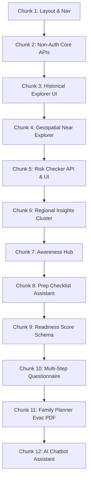

# Phase 4 Implementation Roadmap: Public Portal & Readiness Checker

This document establishes the authoritative implementation plan for Phase 4. It breaks down the citizen-facing preparedness modules into **12 small, vertical chunks**. Each chunk constitutes an independent coding slice that leaves the platform fully operational, including backend routers, database schemas, frontend components, and test coverages.

---

## User Review Required

> [!IMPORTANT]
> The following architectural decisions are established in this plan and require immediate confirmation before proceeding to Chunk 1:
> 1. **Public vs. Authenticated Endpoint Access**: To prevent denial-of-service (DoS) vectors on MongoDB Atlas, public queries (`GET /api/v1/public/disasters` and `/risk-checker`) will have strict rate limits and aggregate caches.
> 2. **Mock AI Assistant Router**: Since external LLM integrations are scheduled for later phases, Chunk 12 implements a deterministic rule-based heuristic parser with static educational matrices stored in a MongoDB collection.

---

## Open Questions

> [!NOTE]
> * **Map Component Visual Library**: Do we want to include a lightweight GeoJSON vector rendering (e.g. `react-simple-maps` / pure SVG) or standard interactive maps? *Recommended: A pure CSS/SVG-based interactive coordinates dashboard to keep Next.js builds slim and fast.*

---

## Proposed Routing Architecture (Next.js)

All frontend routes are structured under the new `(public)` route group to leverage shared EOC headers and footer layouts:

```text
frontend/src/app/(public)/
├── layout.tsx                # Shared PublicLayout with Global Header, Footer, and Theme support
├── page.tsx                  # Home Page (KPIs, Risk Snapshot, timelines)
├── risk-checker/
│   └── page.tsx              # Personal Risk Checker Form & scorecard UI
├── preparedness/
│   └── page.tsx              # Preparedness Assistant (Custom checklist forms)
├── readiness/
│   └── page.tsx              # Readiness score gauge & multi-step questionnaire
├── family-planner/
│   └── page.tsx              # Tabbed Evacuation Planning panels
├── disaster-explorer/
│   └── page.tsx              # Spatial coordinates near explorer & maps table
├── awareness/
│   ├── page.tsx              # Disaster Awareness Hub grid
│   └── [hazard]/
│       └── page.tsx          # Dedicated safety guidelines & historical metrics
├── insights/
│   └── page.tsx              # Regional analytics and K-Means clusters charts
└── assistant/
    └── page.tsx              # Public AI chatbot terminal console
```

---

# Phase 4 Vertical Chunks



---

# Chunk 1
Public Base Layout, Routing, and Navigation System

## Objective
Establish the public layout routing system (`(public)`) with navbars, footers, mobile drawers, breadcrumbs, theme support, and redirect logic.

## Why this chunk comes now
Scaffolds the UI chassis for all future vertical chunks.

## Features covered
* Unified public dashboard shell layout.
* Responsive desktop & mobile EOC navigation bar and theme selectors.
* Navigation link matrices and breadcrumb rendering.

## Backend work
* **Routers**: None.
* **Services**: None.
* **Schemas**: None.

## Frontend work
* **Routes**: Scaffold routes for `(public)/layout.tsx`, `(public)/page.tsx` (Home), `/risk-checker`, `/preparedness`, `/readiness`, `/family-planner`, `/disaster-explorer`, `/awareness`, `/insights`, `/assistant`, `/about`.
* **Components**: Create `PublicNavbar` and `PublicFooter`. Include mobile navigation sheets using Tailwind transitions.
* **Transitions**: Smooth page fade-ins using React transitions.

## API Integration
* None.

## Database work
* None.

## ML integration
* Not applicable.

## UI/UX
* Accessing `http://localhost:3000/` loads the public EOC dashboard framework.
* Sidebar contains redirect options, highlighting current path.

## Files to create
* [NEW] [layout.tsx](file:///d:/Projects/Personal/AI-Disaster-Orchastrator/frontend/src/app/(public)/layout.tsx)
* [NEW] [page.tsx](file:///d:/Projects/Personal/AI-Disaster-Orchastrator/frontend/src/app/(public)/page.tsx)
* [NEW] [Navbar.tsx](file:///d:/Projects/Personal/AI-Disaster-Orchastrator/frontend/src/components/ui/PublicNavbar.tsx)
* [NEW] [Footer.tsx](file:///d:/Projects/Personal/AI-Disaster-Orchastrator/frontend/src/components/ui/PublicFooter.tsx)

## Files to modify
* None.

## Acceptance Criteria
- [ ] Next.js project compiles cleanly with `npm run build`.
- [ ] Navbar links redirect cleanly to empty page shells.
- [ ] Theme toggle correctly updates HTML stylesheet classes.

## Testing
- [ ] Run Next.js static validation.
- [ ] Verify responsive width triggers on mobile widths (320px–768px).

## Risks
* Route conflicts with existing `(auth)` group. Re-validate Next.js route path priorities.

---

# Chunk 2
Non-Authenticated Public Ingestion API Gateway

## Objective
Create a public endpoint to query historical EM-DAT records with pagination and filtering without requiring JWT authorization.

## Why this chunk comes now
Unblocks the search grids and map timelines in future chunks without requiring the user to login.

## Features covered
* Open API access to EM-DAT query logs.
* Filtering by Country, Year, and Disaster Type.

## Backend work
* **Routers**: Add `GET /api/v1/public/disasters` to `backend/app/api/v1/endpoints/public.py`.
* **Services**: Write query builder in database logic returning page metadata.
* **Schemas**: Reuse `PaginatedDisasterRecordsResponse` from `disaster.py`.
* **Validation**: Restrict max limit values to 50 items to prevent memory exhaustion.

## Frontend work
* **Services**: Add `fetchPublicDisasters` call to `frontend/src/lib/api.ts`.

## API Integration
* `GET /api/v1/public/disasters?page=1&limit=20&country=Kenya`
  * Response: `PaginatedDisasterRecordsResponse`

## Database work
* **Queries**: MongoDB find query over `disaster_records` collection leveraging compound index on `country_disasterType_startDate_compound`.

## ML integration
* Not applicable.

## UI/UX
* None (pure API vertical slice).

## Files to create
* [NEW] [public.py](file:///d:/Projects/Personal/AI-Disaster-Orchastrator/backend/app/api/v1/endpoints/public.py)

## Files to modify
* [MODIFY] [api.py](file:///d:/Projects/Personal/AI-Disaster-Orchastrator/backend/app/api/v1/api.py)

## Acceptance Criteria
- [ ] `GET /api/v1/public/disasters` returns code 200 without Auth headers.
- [ ] Pagination limits operate correctly.

## Testing
* **Backend**: Add unit tests inside `backend/tests/test_public.py` using `TestClient`.

## Risks
* Unauthenticated database access performance. Imposed strict limit overrides (le=50).

---

# Chunk 3
Historical Disaster Explorer UI

## Objective
Implement the Public Historical Disaster Explorer dashboard containing filtering forms, paginated datatables, and EOC metric cards.

## Why this chunk comes now
Connects the non-authenticated backend API of Chunk 2 to a fully responsive frontend view.

## Features covered
* **Historical Disaster Explorer** (Module 7).
* Paginated record grids with loading skeleton arrays.

## Backend work
* None.

## Frontend work
* **Routes**: Implement `/disaster-explorer` page.
* **Components**: Create `FilterForm` dropdowns (Country, Year, Disaster Type) and `RecordsTable` grid.
* **Loading States**: Add `Skeleton` row elements.

## API Integration
* Consumes `GET /api/v1/public/disasters`.

## Database work
* Uses query patterns defined in Chunk 2.

## ML integration
* Not applicable.

## UI/UX
* Displays high-density telemetry rows.
* Integrates tabular filter actions. Mobile views collapse columns cleanly.

## Files to create
* [NEW] [page.tsx](file:///d:/Projects/Personal/AI-Disaster-Orchastrator/frontend/src/app/(public)/disaster-explorer/page.tsx)

## Files to modify
* None.

## Acceptance Criteria
- [ ] Search filters dynamically query backend.
- [ ] Table rows render correctly matching standard styling tokens.

## Testing
- [ ] Test component responsiveness.
- [ ] Validate empty states when query returns zero records.

## Risks
* Slow render times for large lists on mobile grids. Handled via pagination limits.

---

# Chunk 4
Geospatial Nearby Disaster Explorer

## Objective
Enable users to search for historical disasters occurring within a defined radius of a geographical coordinate.

## Why this chunk comes now
Builds upon the historical explorer grid, adding localized spatial intelligence.

## Features covered
* **Nearby Disaster Explorer** (Module 2).
* Geospatial distance calculations.

## Backend work
* **Routers**: Add `GET /api/v1/public/disasters/nearby` to `public.py`.
* **Validation**: Require `longitude` (-180 to 180) and `latitude` (-90 to 90).

## Frontend work
* **Components**: Add visual SVG coordinate map widget and distance sliders.
* **Timelines**: Display a vertical EOC timeline card listing nearest historical events.

## API Integration
* `GET /api/v1/public/disasters/nearby?longitude=39.66&latitude=-4.04&radiusKm=500`
  * Response: `List[SpatialResponse]`

## Database work
* **Queries**: Executes `$geoNear` aggregation pipeline over the `2dsphere` index on `geoJSON`.

## ML integration
* Not applicable.

## UI/UX
* Users click a visual locator map or input lat/long, adjusting radius sliders.
* Timelines update with distance tags (e.g., "12.4 km away").

## Files to create
* [NEW] [Timeline.tsx](file:///d:/Projects/Personal/AI-Disaster-Orchastrator/frontend/src/components/ui/Timeline.tsx)

## Files to modify
* [MODIFY] [public.py](file:///d:/Projects/Personal/AI-Disaster-Orchastrator/backend/app/api/v1/endpoints/public.py)
* [MODIFY] [page.tsx](file:///d:/Projects/Personal/AI-Disaster-Orchastrator/frontend/src/app/(public)/disaster-explorer/page.tsx)

## Acceptance Criteria
- [ ] Near coordinate query outputs accurate distance values.
- [ ] Slider changes trigger fetch requests.

## Testing
- [ ] Test with extreme coordinate values (e.g. poles or meridian).
- [ ] Verify correct mapping of GeoJSON points.

## Risks
* Slow geospatial query calculations. Mitigated by indexing and limiting radius to a max of 2000km.

---

# Chunk 5
Personal Risk Checker API & UI

## Objective
Calculate and display regional hazard profiles and disaster frequency metrics based on selected country and region parameters.

## Why this chunk comes now
Calculates core risk coefficients to drive preparedness metrics.

## Features covered
* **Personal Risk Checker** (Module 1).
* Regional risk calculations.

## Backend work
* **Routers**: Add `GET /api/v1/public/risk-checker` to `public.py`.
* **Services**: Aggregate historical occurrences matching country/region parameters. Calculate risk scores (0-100) based on severity distributions.

## Frontend work
* **Routes**: Implement `/risk-checker` route.
* **Layout**: Left-side input fields, right-side risk gauge cards.

## API Integration
* `GET /api/v1/public/risk-checker?country=Kenya&region=Mombasa`
  * Response: `RiskCheckerResponse` (Risk score, common types, count, average deaths).

## Database work
* Run aggregation pipeline grouping by `disasterType` and counting records matching filters.

## ML integration
* Not applicable.

## UI/UX
* Gauge meter shows risk rating (Low: Green, Extreme: Crimson).
* Lists top 3 threats with historical percentages.

## Files to create
* [NEW] [page.tsx](file:///d:/Projects/Personal/AI-Disaster-Orchastrator/frontend/src/app/(public)/risk-checker/page.tsx)

## Files to modify
* [MODIFY] [public.py](file:///d:/Projects/Personal/AI-Disaster-Orchastrator/backend/app/api/v1/endpoints/public.py)

## Acceptance Criteria
- [ ] Endpoint validates missing values cleanly.
- [ ] UI score dynamically transitions color palettes.

## Testing
* **Backend**: Run regression test verifying calculations on populated regions.

## Risks
* Region spelling discrepancies in search queries. Solved by case-insensitive regex pattern mappings.

---

# Chunk 6
Regional Disaster Insights (K-Means Integration)

## Objective
Visualize subregional risk profiling vectors compiled using the offline K-Means machine learning model.

## Why this chunk comes now
Enhances regional hazard exploration by integrating pretrained ML cluster profiles.

## Features covered
* **Regional Disaster Insights** (Module 8).
* Risk profiling visualizations.

## Backend work
* None (uses public endpoint `GET /api/v1/analytics/regional-risk`).

## Frontend work
* **Routes**: Create `/insights` page.
* **Charts**: Render SVG charts illustrating annual damages and mortality risk matrices.
* **Components**: Render EOC metric matrices mapping subregion clusters.

## API Integration
* Consumes `GET /api/v1/analytics/regional-risk`.
  * Response: `List[RegionalRiskClusterResponse]`

## Database work
* Read operations over `regional_risk_clusters` collection.

## ML integration
* Exposes the outputs of the K-Means offline clustering model (Cluster assignments, ordinal risk tiers).

## UI/UX
* Displays an interactive map/chart layout listing 21 global subregions and their corresponding risk categories.

## Files to create
* [NEW] [page.tsx](file:///d:/Projects/Personal/AI-Disaster-Orchastrator/frontend/src/app/(public)/insights/page.tsx)

## Files to modify
* None.

## Acceptance Criteria
- [ ] SVGs scale responsively on mobile ports.
- [ ] Interactive cards display cluster attributes correctly.

## Testing
- [ ] Verify Recharts mounting checks are active to prevent hydration errors.

## Risks
* Hydration mismatches on charting canvases. Managed via layout mounting checks.

---

# Chunk 7
Disaster Awareness Hub & Safety Recommendations

## Objective
Establish a centralized educational center outlining warning indicators, hazard descriptions, and safety checklists.

## Why this chunk comes now
Provides baseline safety information that will be dynamically mapped to preparedness profiles.

## Features covered
* **Disaster Awareness Hub** (Module 3).
* **Safety Recommendations** (Module 9).

## Backend work
* **Database Ingest**: Add a MongoDB collection `disaster_awareness` containing descriptions and safety vectors.
* **Routers**: Add `GET /api/v1/public/awareness` and `GET /api/v1/public/awareness/{hazard}` to `public.py`.

## Frontend work
* **Routes**: Create `/awareness` and dynamic route `/awareness/[hazard]/page.tsx`.
* **Components**: Structured before/during/after checklists.

## API Integration
* `GET /api/v1/public/awareness/{hazard}`
  * Response: `AwarenessResponse` (Description, warning signs, before/during/after lists).

## Database work
* Create collection `disaster_awareness`.
* Document structures contain embedded safety string arrays.

## ML integration
* Not applicable.

## UI/UX
* Navigation grid showing 7 hazard categories (Floods, Earthquakes, etc.).
* Dynamic subpages render detailed EOC checklists.

## Files to create
* [NEW] [page.tsx](file:///d:/Projects/Personal/AI-Disaster-Orchastrator/frontend/src/app/(public)/awareness/page.tsx)
* [NEW] [[hazard]/page.tsx](file:///d:/Projects/Personal/AI-Disaster-Orchastrator/frontend/src/app/(public)/awareness/[hazard]/page.tsx)

## Files to modify
* [MODIFY] [public.py](file:///d:/Projects/Personal/AI-Disaster-Orchastrator/backend/app/api/v1/endpoints/public.py)

## Acceptance Criteria
- [ ] DB data seeds successfully during execution.
- [ ] Tabbed panels toggle safety lists cleanly.

## Testing
- [ ] Verify dynamic routes map correctly.
- [ ] Confirm layout renders on mobile ports.

## Risks
* Empty DB records. Added automated fallback JSON templates in router.

---

# Chunk 8
Preparedness Assistant Checklist Generator

## Objective
Generate customized emergency packing and safety checklists tailored to a selected region and hazard type.

## Why this chunk comes now
Applies localized hazard vectors from Chunk 5/7 to form actionable preparation guidelines.

## Features covered
* **Preparedness Assistant** (Module 4).
* Dynamic checklist builders.

## Backend work
* **Routers**: Add `GET /api/v1/public/preparedness/checklist` to `public.py`.
* **Services**: Merge generic awareness lists with regional risk weight adjustments.

## Frontend work
* **Routes**: Implement `/preparedness` form view.
* **Components**: Checkbox grids and printable formatting frameworks.

## API Integration
* `GET /api/v1/public/preparedness/checklist?country=India&disasterType=Flood`
  * Response: `List[ChecklistItem]`

## Database work
* Read queries matching awareness safety rules.

## ML integration
* Not applicable.

## UI/UX
* Interactive forms return tailored lists (e.g. food/water rations, backup power instructions).
* Includes a direct browser "Print" function.

## Files to create
* [NEW] [page.tsx](file:///d:/Projects/Personal/AI-Disaster-Orchastrator/frontend/src/app/(public)/preparedness/page.tsx)

## Files to modify
* [MODIFY] [public.py](file:///d:/Projects/Personal/AI-Disaster-Orchastrator/backend/app/api/v1/endpoints/public.py)

## Acceptance Criteria
- [ ] Custom checklist generates based on search input.
- [ ] Layout scales to A4 sizing patterns on print commands.

## Testing
- [ ] Validate print stylesheets.
- [ ] Check state preservation during browser reloads.

## Risks
* Check list reset during reload. Saved checklist array in browser local storage.

---

# Chunk 9
Readiness Profile Database Schema & APIs

## Objective
Implement the `readiness_profiles` database collection and JWT-authorized endpoints to track citizen scoreboards.

## Why this chunk comes now
Acts as the persistence layer for the Readiness Score checker and Family Planner.

## Features covered
* **Readiness Score persistence** (Module 6).
* Database validation schemas.

## Backend work
* **Routers**: Add `GET /api/v1/public/readiness` and `PUT /api/v1/public/readiness`.
* **Services**: Score generator calculating readiness rating (0-100) based on checked elements.
* **Schemas**: Add `ReadinessProfileUpdate` validation schema.
* **Auth**: Secure endpoints, permitting access only to accounts with a valid `public_user` token.

## Frontend work
* **Services**: Add `fetchReadinessProfile` and `updateReadinessProfile` APIs.

## API Integration
* `GET /api/v1/public/readiness`
  * Response: `ReadinessProfileResponse`

## Database work
* **Collections**: Write logic targeting the `readiness_profiles` collection.
* **Indexes**: Build a unique compound index on `userId` to prevent duplicate profile documents.

## ML integration
* Not applicable.

## UI/UX
* None (pure API and schema vertical slice).

## Files to create
* [NEW] [readiness.py](file:///d:/Projects/Personal/AI-Disaster-Orchastrator/backend/app/models/schemas/readiness.py)

## Files to modify
* [MODIFY] [public.py](file:///d:/Projects/Personal/AI-Disaster-Orchastrator/backend/app/api/v1/endpoints/public.py)
* [MODIFY] [db_init.py](file:///d:/Projects/Personal/AI-Disaster-Orchastrator/scripts/db_init.py)

## Acceptance Criteria
- [ ] Unauthenticated requests return code 401.
- [ ] Score calculation yields accurate results.

## Testing
* **Backend**: Write test coverage inside `backend/tests/test_readiness.py`.

## Risks
* Database concurrency conflicts. Resolved via unique constraints on `userId`.

---

# Chunk 10
Multi-Step Readiness Assessment UI

## Objective
Build the `/readiness` portal page containing the multi-step diagnostics wizard and score gauge visualization.

## Why this chunk comes now
Connects the readiness storage APIs (Chunk 9) to an interactive, user-facing gauge meter.

## Features covered
* **Readiness Score calculations & Gauges** (Module 6).

## Frontend work
* **Routes**: Implement `/readiness` page.
* **Wizard**: Multi-step layout (Family Details -> Resource Audit -> Preparedness Plan -> Final Rating).
* **Components**: Render animated SVGs representing readiness level tiers.

## API Integration
* Consumes `GET` & `PUT` on `/api/v1/public/readiness`.

## Database work
* Read and write update queries.

## ML integration
* Not applicable.

## UI/UX
* Questionnaire features step indicators.
* Final score renders a gauge moving from Poor (Red) to Excellent (Emerald) with detailed EOC suggestions.

## Files to create
* [NEW] [page.tsx](file:///d:/Projects/Personal/AI-Disaster-Orchastrator/frontend/src/app/(public)/readiness/page.tsx)

## Files to modify
* None.

## Acceptance Criteria
- [ ] Completed forms trigger PUT updates.
- [ ] Visual gauge reflects saved values.

## Testing
- [ ] Validate wizard inputs.
- [ ] Verify routing intercepts unauthorized sessions.

## Risks
* Unsaved changes during wizard progression. Enabled step-wise session saves.

---

# Chunk 11
Family Emergency Planner

## Objective
Implement tabbed planning forms (Household details, Contacts, Evacuation, Medical rules) and save configs to user profiles.

## Why this chunk comes now
Completes the personal planning module, utilizing the layout created in Chunk 9.

## Features covered
* **Family Emergency Planner** (Module 5).

## Backend work
* **Routers**: Add `POST /api/v1/public/family-plan` and `GET /api/v1/public/family-plan` to `public.py`.
* **Validation**: Enforce positive integers on household members.

## Frontend work
* **Routes**: Create `/family-planner` route.
* **Components**: Tabbed panels mapping inputs.

## API Integration
* `POST /api/v1/public/family-plan`
  * Request: `FamilyPlanCreate`
  * Response: `FamilyPlanResponse`

## Database work
* Embeds family plan documents inside the `readiness_profiles` MongoDB model matching `userId`.

## ML integration
* Not applicable.

## UI/UX
* High-density panel mapping contact cards and route coordinates.
* Evacuation tabs render EOC guidelines dynamically.

## Files to create
* [NEW] [page.tsx](file:///d:/Projects/Personal/AI-Disaster-Orchastrator/frontend/src/app/(public)/family-planner/page.tsx)

## Files to modify
* [MODIFY] [public.py](file:///d:/Projects/Personal/AI-Disaster-Orchastrator/backend/app/api/v1/endpoints/public.py)

## Acceptance Criteria
- [ ] Tabbed inputs retain values.
- [ ] Saved planning parameters persist in the database on page reload.

## Testing
- [ ] Test form validators.
- [ ] Validate tab switching doesn't wipe state.

## Risks
* Forms fields overflow on smaller screens. Standardized layout grids using CSS flexbox grids.

---

# Chunk 12
Public AI Assistant Chatbot

## Objective
Develop a public educational chatbot that responds to user preparedness queries using local safety matrices.

## Why this chunk comes now
Concludes Phase 4 by adding a conversational support console.

## Features covered
* **Public AI Assistant** (Module 10).

## Backend work
* **Routers**: Add `POST /api/v1/public/ai-assistant/chat` to `public.py`.
* **Services**: Heuristic classification engine searching for matching keywords. Outputs educational safety bulletins.

## Frontend work
* **Routes**: Implement `/assistant` terminal layout.
* **Components**: Chat console with messaging bubbles and quick-question buttons.

## API Integration
* `POST /api/v1/public/ai-assistant/chat`
  * Request: `ChatMessage`
  * Response: `ChatResponse`

## Database work
* Reads fallback replies from the `disaster_awareness` collection.

## ML integration
* Heuristic matching (mocked inference based on local dataset attributes).

## UI/UX
* Conversational EOC theme chat layout.
* Typing animations and suggested starters.

## Files to create
* [NEW] [page.tsx](file:///d:/Projects/Personal/AI-Disaster-Orchastrator/frontend/src/app/(public)/assistant/page.tsx)

## Files to modify
* [MODIFY] [public.py](file:///d:/Projects/Personal/AI-Disaster-Orchastrator/backend/app/api/v1/endpoints/public.py)

## Acceptance Criteria
- [ ] Chat console responds within 100ms.
- [ ] Keywords trigger correct educational guidance.

## Testing
- [ ] Validate scroll focus actions.
- [ ] Verify message lists scale correctly.

## Risks
* Unmapped user queries. Structured a clean default fallback block suggesting preparedness articles.
